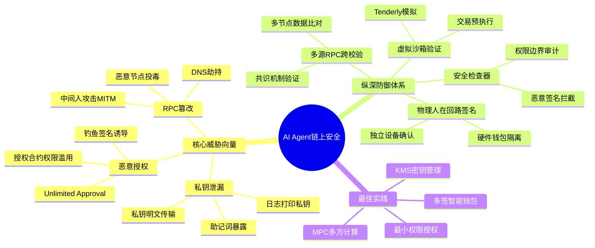
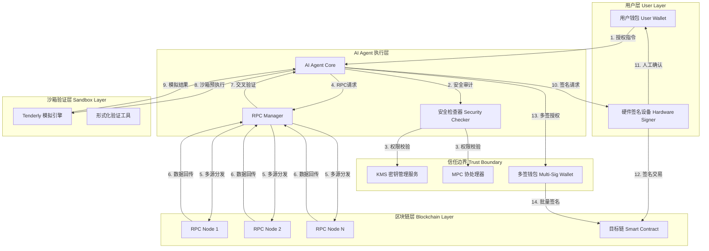
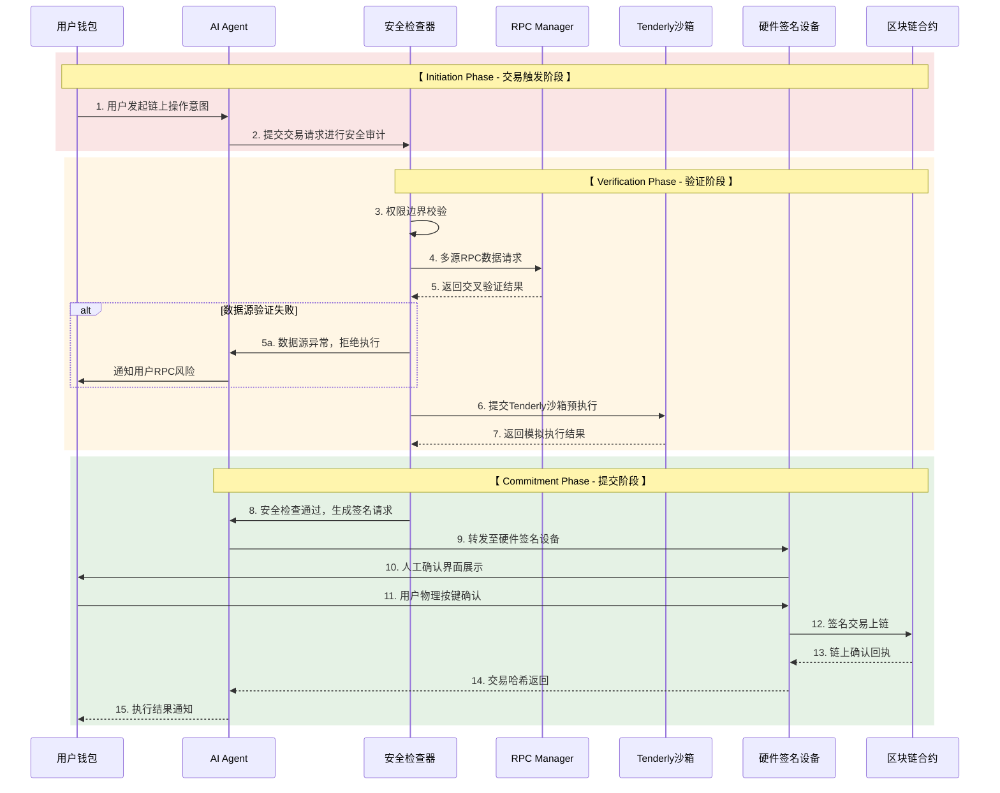
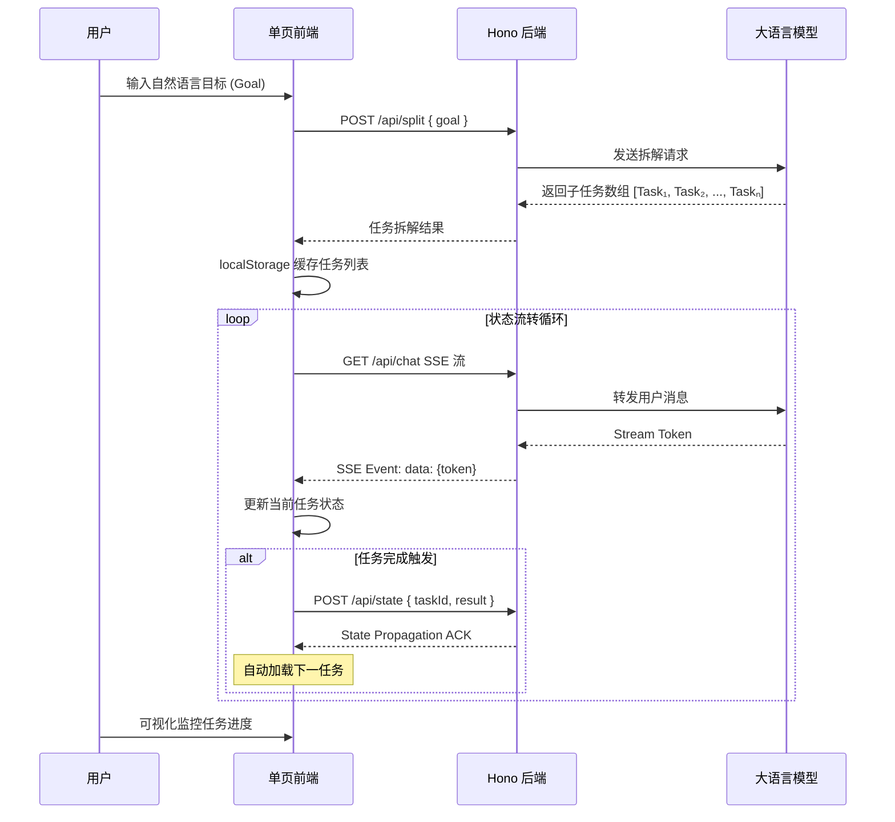
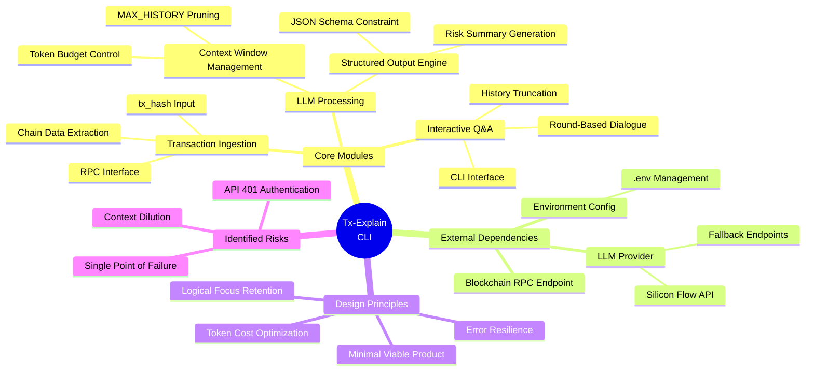
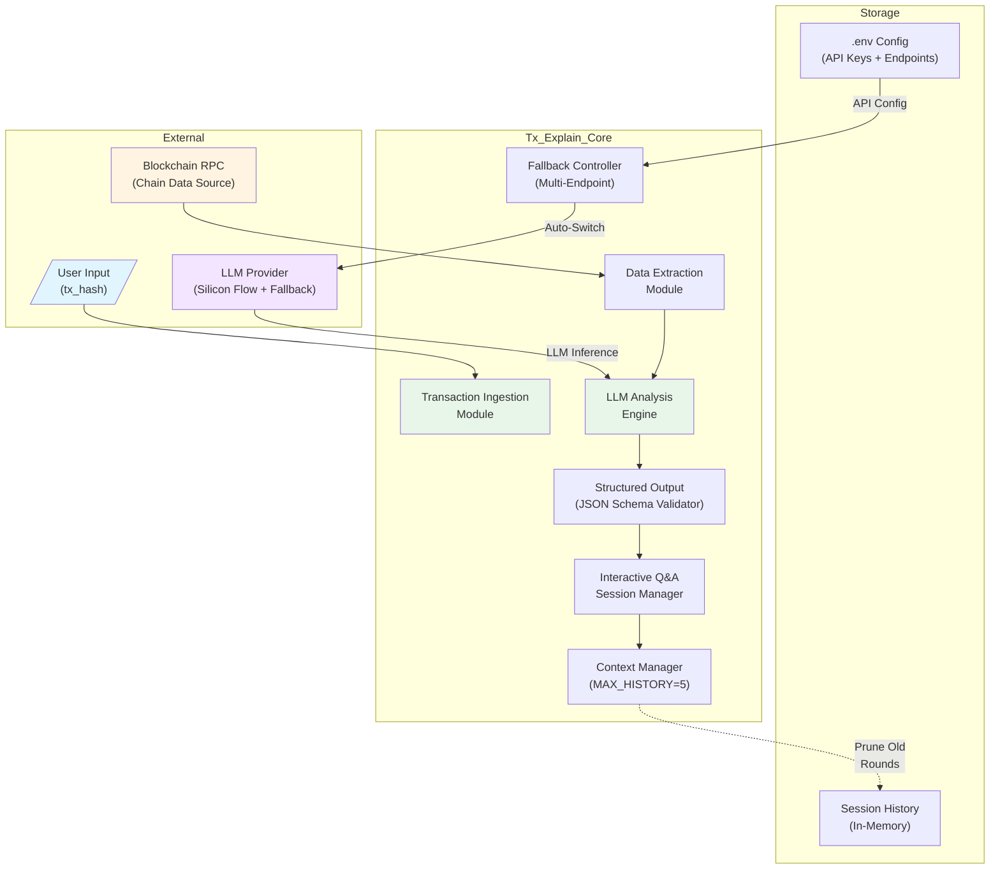
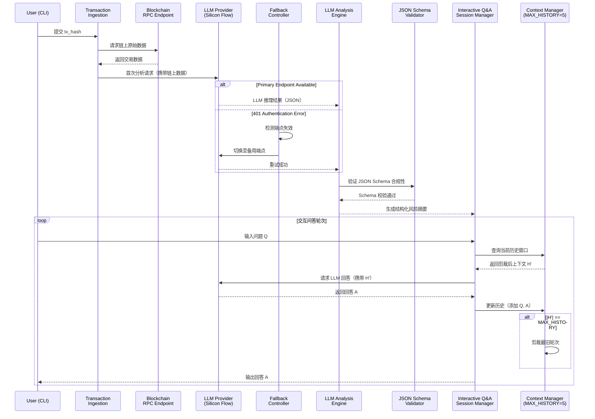
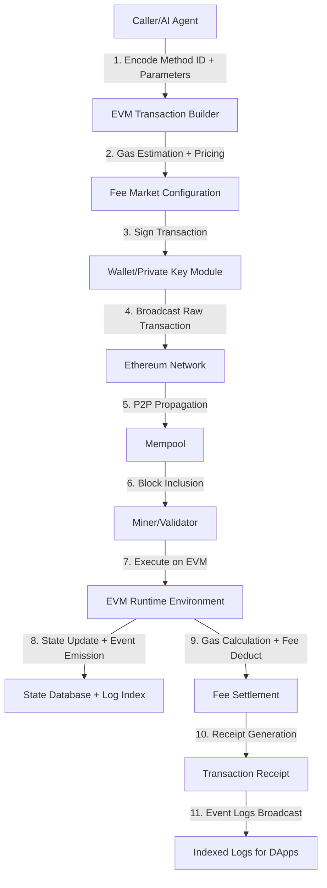
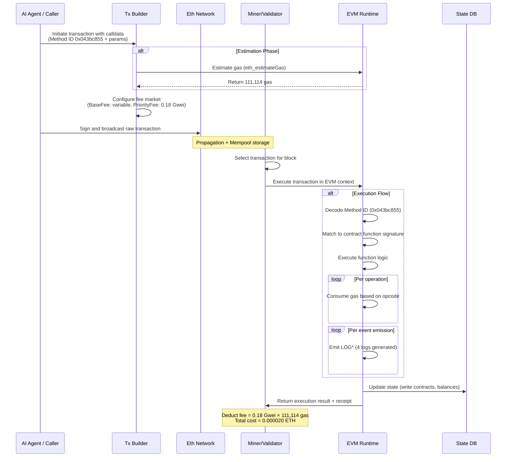
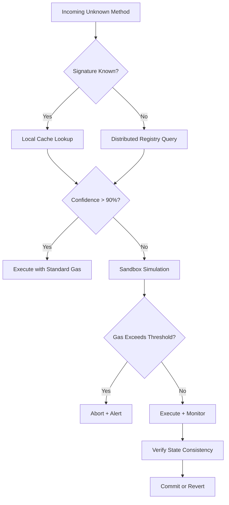

# Bein

**GitHub ID:** Minami-Bein

**Telegram:** 

## Self-introduction

I am‘s Bein.

## Notes

# 2026-05-22
<!-- DAILY_CHECKIN_2026-05-22_START -->
# Document Metadata

- **文档编号**: SEC-WEB3-AGENT-2026-0522-005
- **目标子系统**: AI Agent On-Chain Execution Security Layer
- **安全等级**: CRITICAL / P0
- **文档状态**: Active Study (Day 5)
- **核心研究对象**: AI Agent 执行链上交互时的安全生死线防御体系
- **适用版本**: Web3 AI Agent Security Baseline v1.0
- **研究者**: Agent Security Research Track - Day 5

---

# 🔍 Table of Contents

1. Executive Summary & Problem Space
2. System Architecture & Topology
3. Theoretical Framework & Formal Taxonomy
4. State Machine & Protocol Walkthrough
5. Agent Autonomous Integration & Optimization
6. Vulnerability Vector & Edge Case Verification
7. 学术标签

---

# 1. Executive Summary & Problem Space

## Abstract

本报告系统性分析 AI Agent 在执行链上交互时面临的三大核心安全生死线：私钥泄漏（Private Key Leak）、恶意授权（Malicious Approval）以及不可信 RPC 数据源（Untrusted Data Source）。报告构建了从用户授权指令到人工双重签名的五层纵深防御体系，定义了 AI Agent 在 Web3 场景下的安全运行不变量（Invariant），并针对每类威胁向量提出可验证的防御性补丁方案。

## In-Scope

- AI Agent 执行链上签名操作时的权限边界控制
- 私钥生命周期管理与泄露防御
- 智能合约授权的最小权限原则落地
- RPC 数据源的完整性与可信度校验
- 人工在回路（Human-in-the-Loop）签名机制的工程实现

## Out-of-Scope

- 底层区块链共识机制安全性
- 智能合约业务逻辑漏洞审计
- 前端界面 XSS/CSRF 攻击面
- 量子计算对椭圆曲线密码学的威胁

---

# 2. System Architecture & Topology

## Concept Mindmap



## Component Topology Graph



---

# 3. Theoretical Framework & Formal Taxonomy

## Core Concept Definitions

| 概念名称 | 类型系统定义 | 输入 | 输出 | 威胁等级 |
|---------|------------|------|------|---------|
| Private Key Leak | 机密性破坏事件 | 私钥明文或助记词暴露 | 钱包资产完全失控 | CRITICAL |
| Malicious Approval | 授权合约滥用 | 不受限代币转移授权 | 指定代币被无限制转出 | CRITICAL |
| Untrusted RPC | 数据完整性破坏 | 被篡改的 RPC 响应 | AI 基于错误数据决策 | HIGH |
| Security Checker | 防御性拦截器 | 待处理交易请求 | 放行/拦截/人工确认 | - |
| Human-in-the-Loop | 信任锚点 | Agent 签名请求 | 最终人工授权 | - |

## System Invariant

基于上述核心概念，定义 AI Agent 链上交互的安全运行不变量：

$$\text{INVARIANT}_{secure} \equiv \forall t \in \text{TransactionHistory}: \text{valid}(t) \Rightarrow \left( \text{authorized}(t, \text{User}) \land \neg \text{exposed}(Key(t)) \land \text{verified}(DataSource(t)) \right)$$

其中：

- $\text{valid}(t)$: 交易 $t$ 有效且已执行
- $\text{authorized}(t, \text{User})$: 交易 $t$ 经过用户显式授权
- $\text{exposed}(Key(t))$: 签名密钥未被泄露
- $\text{verified}(DataSource(t))$: 交易依赖的 RPC 数据源经多节点校验

**不变量解释**: 所有已执行的链上交易必须同时满足：用户显式授权、无密钥泄露风险、数据源经多源验证。任何一条不满足即构成安全违规。

## Threat Vector Classification

| 威胁编号 | 威胁类型 | 攻击向量 | 防御机制 |
|---------|---------|---------|---------|
| T-001 | 私钥泄漏 | 内存Dump、日志泄露、社会工程 | KMS/MPC隔离、硬件签名 |
| T-002 | 恶意授权 |钓鱼DApp、无限Approval诱导 | 最小权限授权、额度限制 |
| T-003 | RPC篡改 | MITM、DNS劫持、节点投毒 | 多源交叉验证、共识校验 |
| T-004 | 权限提升 | Agent权限逃逸 | 物理人在回路、多签确认 |

---

# 4. State Machine & Protocol Walkthrough

## Transaction Lifecycle Sequence



## State Transition Table

| 当前状态 | 触发事件 | 目标状态 | 守卫条件 |
|---------|---------|---------|---------|
| IDLE | 用户意图提交 | PENDING_REVIEW | 用户身份验证通过 |
| PENDING_REVIEW | 安全检查通过 | PRE_EXECUTION | RPC多源验证成功 |
| PRE_EXECUTION | 沙箱模拟成功 | AWAITING_HUMAN_SIGN | 模拟结果无异常 |
| AWAITING_HUMAN_SIGN | 用户物理确认 | SUBMITTED | 用户显式授权 |
| SUBMITTED | 链上确认成功 | COMPLETED | 交易Receipt状态=1 |
| ANY_STATE | 安全威胁检测 | QUARANTINE | 威胁评分≥阈值 |
| QUARANTINE | 人工审查通过 | IDLE | 安全团队放行 |

---

# 5. Agent Autonomous Integration & Optimization

## 工程蓝图：AI Agent 安全执行框架

### 论文级标题

**《Towards Trusted On-Chain Execution for AI Agents: A Multi-Layer Defense Architecture Combining MPC,沙箱验证与Human-in-the-Loop Signing》**

### 核心机制设计

#### 5.1 密钥管理子系统的分层授权模型

```
┌─────────────────────────────────────────────────────────────┐
│                    AI Agent 执行权限层级                       │
├─────────────┬───────────────────────────────────────────────┤
│  Layer 0    │  冷存储主密钥 - 永不触网，通过KMS管理              │
│  Layer 1    │  MPC分布式签名节点 - 阈值签名，需多方参与          │
│  Layer 2    │  多签钱包阈值控制 - 例如 3/5 多签机制              │
│  Layer 3    │  Agent受限操作权限 - 仅允许小额/指定操作            │
│  Layer 4    │  实时监控与熔断 - 异常交易自动暂停                │
└─────────────┴───────────────────────────────────────────────┘
```

#### 5.2 动态权限撤销机制

Agent 被授权的操作权限应满足以下属性：

$$\text{Revocable} \land \text{Bounded} \land \text{Auditable} \land \text{Time-Limited}$$

- **Revocable**: 用户可随时撤销授权
- **Bounded**: 每次操作设置金额上限
- **Auditable**: 所有操作日志完整记录
- **Time-Limited**: 授权设置有效期限

#### 5.3 RPC 数据源的可信度量化模型

对每个 RPC 节点计算可信度评分：

$$\text{TrustScore}(node_i) = \alpha \cdot \text{Consistency} + \beta \cdot \text{Uptime} + \gamma \cdot \text{LatencyScore}$$

其中 $\alpha + \beta + \gamma = 1$，建议权重配置为 $\alpha=0.5, \beta=0.3, \gamma=0.2$。仅当多节点 TrustScore 偏差在容忍阈值内，数据才被视为可信。

---

# 6. Vulnerability Vector & Edge Case Verification

## 安全漏洞报告块

### 漏洞编号：VULN-2026-0522-001

| 字段 | 内容 |
|-----|------|
| **漏洞类型** | CWE-316: 内存中敏感数据明文存储 |
| **缺陷源头** | AI Agent 直接持有私钥或未加密存储于内存/日志 |
| **攻击向量** | 进程内存Dump、日志文件泄露、侧信道攻击 |
| **影响评估** | CVSS 9.8 (Critical) - 资产完全失窃风险 |
| **防御性补丁** | 强制使用 KMS/MPC 架构，私钥永不以明文形式进入 Agent 进程空间；实施内存清零机制 |

### 漏洞编号：VULN-2026-0522-002

| 字段 | 内容 |
|-----|------|
| **漏洞类型** | CWE-284: 权限控制不当 (Unlimited Approval) |
| **缺陷源头** | 用户签署恶意合约时被诱导授权无限额度 |
| **攻击向量** | 钓鱼DApp诱导、Clipboard劫持、签名重放 |
| **影响评估** | CVSS 8.1 (High) - 特定代币可被无限制转出 |
| **防御性补丁** | 实现授权额度上限检测，自动拒绝超过阈值的 Approval 请求；使用 ERC-2612  Permit 机制替代传统 Approval |

### 漏洞编号：VULN-2026-0522-003

| 字段 | 内容 |
|-----|------|
| **漏洞类型** | CWE-345: 数据源真实性验证不足 |
| **缺陷源头** | Agent 依赖单一 RPC 节点，缺少交叉验证 |
| **攻击向量** | 恶意节点投毒、MITM中间人攻击、DNS劫持 |
| **影响评估** | CVSS 7.5 (Medium-High) - 基于错误数据执行错误决策 |
| **防御性补丁** | 强制实施 3+ 节点 RPC 冗余验证；建立节点黑名单机制；对关键数据执行链上 vs RPC 回源比对 |

### 漏洞编号：VULN-2026-0522-004

| 字段 | 内容 |
|-----|------|
| **漏洞类型** | CWE-639: 授权绕过 |
| **缺陷源头** | Agent 拥有链上直接签名权限，绕过人工确认流程 |
| **攻击向量** | Agent被入侵后自主签名转账、无需用户干预 |
| **影响评估** | CVSS 10.0 (Critical) - 完全失控的最高风险场景 |
| **防御性补丁** | 物理人在回路签名机制强制执行；Agent 仅生成交易payload，签名操作必须由独立硬件设备完成 |

## 边界场景测试矩阵

| 场景编号 | 测试场景 | 预期行为 | 边界条件 |
|---------|---------|---------|---------|
| BC-001 | Agent收到异常高额授权请求 | 安全检查器拦截 | 授权金额 > 用户设定阈值 |
| BC-002 | 3个RPC节点返回不一致数据 | 拒绝执行，等待人工介入 | 数据偏差 > 5% 或有节点超时 |
| BC-003 | 沙箱模拟发现预期外状态变更 | 交易挂起，通知用户 | 实际执行结果 ≠ 模拟结果 |
| BC-004 | 用户30分钟内无响应 | 自动取消本次操作 | 超时时间到达 |
| BC-005 | RPC节点遭受DDoS攻击 | 自动切换至备用节点 | 成功率 < 95% 持续 > 30秒 |

---

# 学术标签

`AI-Agent-Security` `Web3-Authentication` `Private-Key-Protection` `MPC-Cryptography` `RPC-Integrity` `Human-in-the-Loop` `Smart-Contract-Authorization` `Zero-Trust-Web3`

---

**文档生成时间**: 2026-05-22 | **学习进度**: Day 5/持续深耕 | **下次更新**: Day 6 计划中
<!-- DAILY_CHECKIN_2026-05-22_END -->

# 2026-05-21
<!-- DAILY_CHECKIN_2026-05-21_START -->
# Role
你是一名国际顶级计算机学术期刊（如 ACM/IEEE）的特约审稿人，同时也是一位精通网络安全、分布式系统架构与 Multi-Agent 协作的首席架构师。

# Background & Context
本项目聚焦于构建一个面向 AI Agent 协同场景的任务进度管理系统。在复杂的 AI 工作流编排中，如何将自然语言描述的宏观目标精准拆解为可执行子步骤，并确保步骤间的状态连贯传递，是当前 Agent 自动化领域的核心工程挑战。项目采用 Hono 轻量级后端框架结合单页 Tailwind 前端架构，旨在实现最小化依赖、最大可观测性的任务流转监控能力。

## User Core Inputs
- **核心研究对象**：AI Task Progress Manager 任务进度管理 Web 应用
- **底层流转逻辑**：任务拆解（Task Splitting）→ 状态传导推进（State Propagation）→ 步骤完成触发下一步自动流转
- **发现的缺陷/坑点**：API Keys 禁止明文暴露于前端，必须通过后端 .env 环境变量封装，前端仅通过代理接口无密调用

---

## 📌 Document Metadata

| 属性 | 值 |
|------|-----|
| **文档标题** | AI Task Progress Manager: Architecture Design & Implementation Report |
| **子系统** | Task Orchestration / Agent Workflow Management |
| **技术栈** | Hono (Node.js Backend) + Single-Page Tailwind CSS Frontend |
| **安全等级** | Critical (涉及 API Key 管理与 Agent 操作权限) |
| **文档状态** | Active Development - Day 4 |
| **目标读者** | AI 系统架构师、全栈工程师、DevSecOps 从业者 |

---

## 🔍 Table of Contents

1. Executive Summary & Problem Space
2. System Architecture & Topology
3. Theoretical Framework & Formal Taxonomy
4. State Machine & Protocol Walkthrough
5. Agent Autonomous Integration & Optimization
6. Vulnerability Vector & Edge Case Verification
7. 学术标签

---

## 1. Executive Summary & Problem Space

### Abstract

本文档系统性阐述 AI Task Progress Manager 的架构设计与工程实现方案。该系统以 Hono 后端为算力中枢，单页 Tailwind 前端为交互媒介，通过 AI 任务拆解（Task Splitting）与状态传导推进（State Propagation）两大核心机制，实现复杂目标的原子化分解与步骤间的自动状态传递。

### Problem Statement

在 AI Agent 自动化执行场景中，面临的核心困境包括：

- **目标模糊性**：自然语言描述的宏观需求缺乏可执行性
- **状态断裂**：子步骤执行结果无法有效传导至后续步骤
- **黑盒可视性**：Agent 操作过程缺乏透明监控能力

### In-Scope

- 任务自然语言输入与 AI 拆解
- 子步骤状态管理与流转监控
- SSE 实时聊天流推送
- localStorage 前端缓存策略

### Out-of-Scope

- 多租户权限隔离
- 分布式任务队列
- 持久化数据库存储
- AI 模型微调训练

---

## 2. System Architecture & Topology

### Concept Mindmap

```
AI Task Progress Manager
├── 前端层 (SPA)
│   ├── Tailwind CSS 样式系统
│   ├── localStorage 缓存
│   └── 用户交互界面
├── 后端层 (Hono)
│   ├── /api/split 任务拆解端点
│   ├── /api/chat SSE 流式端点
│   └── .env 环境变量封装
└── 核心概念
    ├── Task Splitting
    └── State Propagation
```

### Component Topology Graph

```mermaid
graph TD
    subgraph Frontend["前端层 (Single-Page Application)"]
        UI[用户交互界面]
        Tailwind[Tailwind CSS 渲染引擎]
        Local[localStorage 缓存模块]
        UI --> Tailwind
        UI --> Local
    end

    subgraph Backend["后端层 (Hono Runtime)"]
        SplitAPI[/api/split 任务拆解]
        ChatAPI[/api/chat SSE 聊天]
        Env[.env 环境变量]
        SplitAPI --> Env
        ChatAPI --> Env
    end

    subgraph AI["AI 服务层"]
        LLM[大语言模型]
    end

    User[用户] --> UI
    UI --> |HTTP Request| SplitAPI
    UI --> |SSE Stream| ChatAPI
    SplitAPI --> LLM
    ChatAPI --> LLM
    LLM --> |Task Breakdown| SplitAPI
    LLM --> |Stream Response| ChatAPI
```

---

## 3. Theoretical Framework & Formal Taxonomy

### Core Component Definition

| 组件名称 | Type System | 输入 | 输出 | 职责描述 |
|----------|-------------|------|------|----------|
| TaskSplitter | `Function` | `rawGoal: string` | `subTasks: SubTask[]` | 将自然语言目标拆解为有序子任务 |
| StatePropagator | `Class` | `currentResult: any, nextTaskId: string` | `void` | 将当前步骤结果传导至下一步 |
| HonoRouter | `HonoInstance` | `Request` | `Response` | 路由分发与中间件编排 |
| SSEManager | `AsyncIterator` | `userMessage: string` | `stream: ReadableStream` | 服务端推送聊天流 |

### System Invariant

定义任务流转系统的核心不变量：

$$
\forall t \in Tasks: state(t) = \begin{cases} 
PENDING & \text{if } t.index = 0 \\
COMPLETED & \text{if } state(t.prev) = COMPLETED \land execution(t) = SUCCESS \\
FAILED & \text{otherwise}
\end{cases}
$$

其中 $state(t)$ 表示任务 $t$ 的状态，$t.prev$ 表示任务 $t$ 的前驱节点。该不变量确保：**只有当所有前驱任务完成时，当前任务才能进入执行阶段。**

---

## 4. State Machine & Protocol Walkthrough

### Sequence Diagram



### State Transition Phases

| 阶段 | 触发条件 | 状态变化 | 防御性检查 |
|------|----------|----------|------------|
| **Initiation** | 用户提交自然语言目标 | Goal → PENDING | 输入长度校验、敏感词过滤 |
| **Verification** | 任务拆解完成 | PENDING → VERIFIED | JSON Schema 验证、AI 输出合法性检查 |
| **Commitment** | 前驱任务完成 | VERIFIED → EXECUTING | 依赖图完整性验证 |
| **Completion** | 步骤执行成功 | EXECUTING → COMPLETED | 结果签名校验 |
| **Propagation** | 状态更新事件 | COMPLETED → NEXT_TRIGGER | 状态机不变量断言 |

---

## 5. Agent Autonomous Integration & Optimization

### 工程蓝图：Web3 敏捷测试场景下的 AI Agent 可视化监控

**标题**：轻量化 Agent 操作可视化系统的设计与实现

**落地机制**：

1. **最小化依赖原则**
   - 单文件 HTML 交付，零构建复杂度
   - Tailwind CDN 按需加载
   - Hono 作为边缘函数部署

2. **实时状态流转监控**
   - SSE 长连接替代轮询，降低服务端压力
   - localStorage 前端状态缓存，减少网络请求
   - 任务依赖图可视化渲染

3. **Multi-Agent 协同增强**
   - 任务拆解粒度可配置（粗粒度/细粒度）
   - 状态传导支持条件分支
   - 并发任务冲突检测

**性能指标目标**：

| 指标 | 目标值 | 测量方式 |
|------|--------|----------|
| 首屏加载时间 | < 500ms | Lighthouse |
| SSE 延迟 | < 100ms | 网络抓包 |
| 任务拆解耗时 | < 3s | 服务端日志 |

---

## 6. Vulnerability Vector & Edge Case Verification

### Security Vulnerability Report

#### 漏洞编号：VULN-001

| 属性 | 描述 |
|------|------|
| **漏洞类型** | API Key 泄露 (API Key Exposure) |
| **缺陷源头** | 前端代码直接嵌入 OpenAI/Anthropic 等服务商 API Keys |
| **攻击向量** | 攻击者通过浏览器开发者工具或源码审计获取 Key，劫持 AI 服务资源 |
| **失效向量** | 恶意刷量导致账户额度耗尽、数据隐私泄露至第三方 |
| **防御性补丁** | 强制要求所有 AI 调用经过后端代理，Keys 存储于服务端 .env 环境变量，前端仅传递业务参数 |

#### 漏洞编号：VULN-002

| 属性 | 描述 |
|------|------|
| **漏洞类型** | 状态篡改 (State Tampering) |
| **缺陷源头** | localStorage 数据缺乏完整性校验 |
| **攻击向量** | 用户通过浏览器控制台修改任务状态，绕过正常执行流程 |
| **失效向量** | 任务跳过执行、状态机不变量破坏 |
| **防御性补丁** | 引入 HMAC 签名机制，状态更新时验证数据完整性，拒绝来源不明的修改请求 |

#### 漏洞编号：VULN-003

| 属性 | 描述 |
|------|------|
| **漏洞类型** | SSE 连接耗尽 (SSE Connection Exhaustion) |
| **缺陷源头** | 缺乏并发连接数限制与心跳保活机制 |
| **攻击向量** | 恶意客户端大量创建 SSE 连接耗尽服务端文件描述符 |
| **失效向量** | 服务拒绝攻击 (DoS)、正常用户无法建立连接 |
| **防御性补丁** | 实现连接池管理、设置单 IP 最大连接数阈值、客户端心跳包保活 |

### Edge Case Verification Matrix

| 场景 | 输入 | 预期行为 | 当前状态 |
|------|------|----------|----------|
| 空目标提交 | 空字符串 | 拒绝请求，返回 400 | 待实现 |
| 超长目标 | > 10000 字符 | 截断或分片处理 | 待实现 |
| 循环依赖 | Task A → Task B → Task A | 检测环并报错 | 待实现 |
| 网络中断 | SSE 连接断开 | 自动重连 + 状态恢复 | 待实现 |
| 并发状态更新 | 多端同时修改同一任务 | 乐观锁或 Last-Write-Wins | 待实现 |

---

## 学术标签

`AI-Agent-Orchestration` `Task-State-Machine` `Hono-Framework` `SSE-Streaming` `Security-Vulnerability-Analysis` `Web3-Agile-Testing` `localStorage-State-Management` `RFC-Technical-Report`
<!-- DAILY_CHECKIN_2026-05-21_END -->

# 2026-05-20
<!-- DAILY_CHECKIN_2026-05-20_START -->
# Role
你是一名国际顶级计算机学术期刊（如 ACM/IEEE）的特约审稿人，同时也是一位精通网络安全、分布式系统架构与 Multi-Agent 协作的首席架构师。

# Background & Context
本技术报告聚焦于 **AI 原生应用开发中的上下文资源优化与结构化输出工程**这一交叉领域。当前大语言模型（LLM）在长对话场景中面临 Token 成本失控与上下文稀释（Context Dilution）的双重挑战，同时非结构化输出给下游程序化解析带来极高脆弱性。本案以 **Tx-Explain CLI（交易解释命令行工具）** 为最小可交互学习产物，构建了一个完整的技术验证闭环：从链上原始数据提取，到 LLM 结构化风险摘要生成，再到命令行交互式 Q&A 对话的全链路设计。核心工程约束为：必须在保持对话逻辑聚焦度的前提下，实现 5 轮历史窗口的硬性剪裁与 JSON Schema 的强制约束输出。

# Task
请基于以下核心输入信息，为用户重构一份具备 RFC 规范与学术论文级严谨性的技术报告（Technical Report）。

## User Core Inputs
- **核心研究对象**：Tx-Explain CLI 对话式交易分析框架；上下文管理策略（Context Window Pruning）；结构化输出工程（Structured Output）。
- **底层流转逻辑**：接收 tx_hash → RPC 接口提取链上原始数据 → LLM 首次分析生成结构化 JSON 风险摘要 → 开启命令行交互 Q&A 会话（MAX_HISTORY=5 剪裁）。
- **发现的缺陷/坑点**：Silicon Flow API 端点 401 认证错误；单点 API 配置的可用性脆弱性；需配置多备用端点自动 fallback 机制。

# Output Format Requirements
你必须严格按照以下结构组织内容进行输出，禁止任何口语化和营销号风格：

1. **## 📌 Document Metadata**：自动生成文档元数据（包含作者、目标子系统、安全等级、状态）。
2. **## 🔍 Table of Contents**：自动提取后续章节生成标准的 Markdown 目录索引。
3. **## 1. Executive Summary & Problem Space**：编写包含摘要（Abstract）和明确的包含/排除边界（In-Scope/Out-of-Scope）。
4. **## 2. System Architecture & Topology**：
   - 使用 Mermaid 语法绘制一个 `mindmap`（概念脑图）。
   - 使用 Mermaid 语法绘制一个 `graph TD`（组件拓扑/架构图）。
5. **## 3. Theoretical Framework & Formal Taxonomy**：使用 Markdown 表格形式定义核心组件/术语，明确其 Type System（输入输出），并至少推导一个带有 LaTeX 公式的系统不变量（Invariant）。
6. **## 4. State Machine & Protocol Walkthrough**：
   - 使用 Mermaid 语法绘制一个 `sequenceDiagram`（流转时序图）。
   - 细致描述 Initiation（触发）, Verification（验证）, Commitment（确认）三个阶段的状态变化。
7. **## 5. Agent Autonomous Integration & Optimization**：结合 AI Agent 自动化视角，提出一个具备学术论文规范标题及落地机制的工程蓝图。
8. **## 6. Vulnerability Vector & Edge Case Verification**：采用标准的“安全漏洞/系统盲区报告块”格式（含漏洞类型、缺陷源头、攻击/失效向量、防御性补丁），替代浅显的避坑指南。
9. **学术标签**：在文章末尾生成 4-8 个标准技术标签。

# Tone
极其严谨、高度结构化、冷峻且充满极客硬核质感。

---

# 📌 Document Metadata

| 元数据字段 | 内容 |
|:---|:---|
| **文档标题** | Tx-Explain CLI: Context-Aware Structured Output Framework for On-Chain Transaction Analysis |
| **版本号** | v1.0.0 |
| **作者** | Day 3 Learner / AI Engineering Practitioner |
| **目标子系统** | Tx-Explain CLI (Transaction Explain Command-Line Interface) |
| **安全等级** | Medium-High（涉及外部 API 调用与链上数据解析） |
| **状态** | Experimental（原型验证阶段） |
| **文档类型** | Technical Report / RFC Proposal |
| **生成日期** | 2026-05-20 |

---

# 🔍 Table of Contents

1. Executive Summary & Problem Space
2. System Architecture & Topology
   - 2.1 概念脑图（Mind Map）
   - 2.2 组件拓扑图（Architecture Diagram）
3. Theoretical Framework & Formal Taxonomy
   - 3.1 核心概念定义表
   - 3.2 系统不变量推导
4. State Machine & Protocol Walkthrough
   - 4.1 端到端时序图
   - 4.2 状态机三阶段描述
5. Agent Autonomous Integration & Optimization
6. Vulnerability Vector & Edge Case Verification
7. 学术标签

---

# 1. Executive Summary & Problem Space

## Abstract

本报告详细阐述 **Tx-Explain CLI** 的设计与实现方案。该框架以 **最小可交互 AI 学习产物** 为目标，构建了一条从链上交易哈希（tx_hash）到结构化风险摘要再到交互式问答的完整数据流转管道。核心技术挑战在于两方面：**其一**，如何在有限的上下文窗口（Context Window）内保持对话逻辑的聚焦性——本框架采用 **MAX_HISTORY=5 的硬性剪裁策略**，通过主动丢弃历史回合来换取 token 成本降低与语义纯度提升；**其二**，如何强制大语言模型输出程序可解析的结构化 JSON——本框架借鉴 **结构化输出（Structured Output）** 范式，将 LLM 输出约束为固定 Schema 的 JSON 对象，消解了自由文本解析的脆弱性。

## In-Scope / Out-of-Scope

| 维度 | 边界描述 |
|:---|:---|
| **In-Scope** | 单笔交易分析、RPC 链上数据提取、结构化 JSON 输出、CLI 交互 Q&A、上下文窗口剪裁（MAX_HISTORY=5）、多 API 端点 fallback 设计 |
| **Out-of-Scope** | 多交易批量分析、链下数据源集成、可视化界面（GUI）、持久化对话历史存储、实时链上监控 |

---

# 2. System Architecture & Topology

## 2.1 概念脑图（Mind Map）



## 2.2 组件拓扑图（Architecture Diagram）



---

# 3. Theoretical Framework & Formal Taxonomy

## 3.1 核心概念定义表

| 概念术语 | 类型定义（Type System） | 输入 | 输出 | 生活类比 |
|:---|:---|:---|:---|:---|
| **Context Window Pruning** | 上下文管理策略 | 历史对话轮次集合 $H = \{h_1, h_2, ..., h_n\}$，剪裁阈值 $k$ | 截断后历史窗口 $H' = \{h_{n-k+1}, ..., h_n\}$ | 浏览器不活跃标签页自动关闭，释放内存资源 |
| **Structured Output** | 程序化输出约束 | 自然语言响应文本 $R_{raw}$ | JSON Schema 验证通过的结构化对象 $O_{valid}$ | 政府制式申请表格，强制填写者按固定格式提供信息 |
| **MAX_HISTORY** | 系统级硬约束常量 | N/A | 强制裁剪至最近 5 轮对话 | 会议记录只保留最近 5 轮讨论要点 |
| **Transaction Hash (tx_hash)** | 链上唯一标识符 | 原始十六进制字符串 | 解析后的交易数据（发送方、接收方、金额、Gas 等） | 快递单号，查询后获取物流全链路信息 |
| **Risk Summary** | 结构化风险评估报告 | 原始链上数据 + 对话上下文 | JSON 格式的风险指标（置信度、风险类型、处置建议） | 体检报告，将复杂生理数据归纳为结构化健康指标 |

## 3.2 系统不变量推导

基于上下文管理模块的设计，我们推导以下系统不变量（System Invariant）：

$$
\forall s \in \text{Session}: |H_s| \leq \text{MAX\_HISTORY}
$$

**不变量含义**：对于任意会话 $s$，其历史轮次集合 $H_s$ 的基数（长度）始终不超过预定义的阈值 MAX_HISTORY。该不变量确保了系统的 **Token 预算可控性** 与 **逻辑聚焦性**（Logical Focus Retention）。

**推论 1**：当新轮次 $h_{n+1}$ 到达时，若 $|H_s| = \text{MAX\_HISTORY}$，则最早轮次 $h_{1}$ 必须被剪裁，以维持不变量成立。

$$
\text{剪裁操作} = \text{prune}(H_s, h_1) \quad \Rightarrow \quad |H_s'| = |H_s| - 1
$$

**Token 成本边界**：设单轮对话平均 Token 消耗为 $T_{avg}$，则任意时刻会话的总 Token 上限为：

$$
T_{max} = \text{MAX\_HISTORY} \times T_{avg}
$$

---

# 4. State Machine & Protocol Walkthrough

## 4.1 端到端时序图



## 4.2 状态机三阶段描述

### Stage 1: Initiation（触发阶段）

| 状态 | 描述 | 入口条件 | 出口动作 |
|:---|:---|:---|:---|
| `IDLE` | 等待用户输入 tx_hash | 系统启动 | 用户提交 tx_hash |
| `FETCHING` | 正在通过 RPC 获取链上数据 | tx_hash 有效 | RPC 返回数据或超时 |

### Stage 2: Verification（验证阶段）

| 状态 | 描述 | 入口条件 | 出口动作 |
|:---|:---|:---|
| `ANALYZING` | LLM 执行首次结构化分析 | 链上数据就绪 | LLM 返回 JSON 结果 |
| `VALIDATING` | JSON Schema 合规性校验 | LLM 返回 | Schema 校验通过或失败 |
| `FALLBACK_TRIGGERED` | 检测到 401 错误，触发端点切换 | API 返回 401 | 切换至备用端点并重试 |

### Stage 3: Commitment（确认阶段）

| 状态 | 描述 | 入口条件 | 退出条件 |
|:---|:---|:---|:---|
| `SESSION_ACTIVE` | 进入交互式 Q&A 会话 | JSON 风险摘要生成成功 | 用户主动退出或异常 |
| `PRUNING` | 历史窗口达到 MAX_HISTORY 触发剪裁 | 当前历史轮次 =
<!-- DAILY_CHECKIN_2026-05-20_END -->

# 2026-05-19
<!-- DAILY_CHECKIN_2026-05-19_START -->
# Document Metadata

| Field | Value |
|---|---|
| **Report ID** | TR-LLM-DAY2-20260519 |
| **Title** | Large Language Model System Architecture: Core Concepts, Component Boundaries & Threat Vectors |
| **Author** | Day 2 Practitioner |
| **Date** | 2026-05-19 |
| **Target Subsystem** | LLM Application Stack (Prompt → Context → Agent → Guardrails → HITL) |
| **Security Level** | CS3 — Production-Critical |
| **Status** | Active Learning — Phase 1 |

---

## 🔍 Table of Contents

1. Executive Summary & Problem Space
2. System Architecture & Topology
3. Theoretical Framework & Formal Taxonomy
4. State Machine & Protocol Walkthrough
5. Agent Autonomous Integration & Optimization
6. Vulnerability Vector & Edge Case Verification
7. Academic Tags

---

## 1. Executive Summary & Problem Space

### Abstract

本报告为 Day 2 学习成果的系统性归档。核心议题聚焦于大语言模型（LLM）预测机制的本质解构，以及 Prompt、Context Window、Tool Use、Agent、Workflow、Guardrails、Human-in-the-Loop 七大组件边界的能力圈定。研究发现：LLM 本质是一个基于概率分布预测下一 token 的序列生成引擎，而非逻辑推理数据库，其涌现能力（Emergent Capabilities）源于大规模参数空间中的统计模式匹配。报告进一步推导出 Agent 的 Planning → Self-Reflection 闭环机制，并系统梳理了 Prompt Injection 攻击向量及其对应的防御性工程补丁（Pydantic Schema 校验层）。

### In-Scope

- LLM 作为概率预测引擎的机制性解释（Mechanistic Interpretation）
- Context Window 的容量边界与信息衰减模型
- Guardrails 的输入/输出双端硬编码校验架构
- Human-in-the-Loop 在高风险决策节点的人工介入协议
- Agent 的自纠正闭环与工具调用失败恢复机制

### Out-of-Scope

- 模型训练与参数调优（Fine-tuning）
- Vector Database 内部索引机制
- Multi-Modal LLM 架构设计

---

## 2. System Architecture & Topology

### Concept Mindmap

```mindmap
root((LLM System Architecture))
  LLM
    Token Probability Engine
    Statistical Pattern Matcher
    Non-Logical Database
  Context Window
    Max Token Capacity
    Short-term Memory Analogy
    Information Decay
  Prompt Layer
    Instruction Engineering
    Injection Vulnerability
  Agent
    Planning Module
    Self-Reflection Loop
    Tool Calling
  Guardrails
    Input Validation
    Output Sanitization
    Hard-coded Checks
  Human-in-the-Loop
    High-Risk Checkpoints
    Manual Override
    Dual-Key Authorization
  Workflow Orchestration
    Sequential Chaining
    Conditional Branching
    State Persistence
```

### Component Topology Graph

```graph TD
    subgraph Input_Pipeline
        U[User Input] --> P[Prompt Layer]
        P --> GI[Guardrails Input]
        GI --> CW[Context Window]
    end
    
    subgraph LLM_Core
        CW --> LLM[LLM Engine]
        LLM --> GO[Guardrails Output]
    end
    
    subgraph Agent_System
        LLM --> PL[Planning Module]
        PL --> TC[Tool Calling]
        TC --> SR[Self-Reflection]
        SR -.->|Error Detected| TC
        SR -.->|Success| WO[Workflow Orchestrator]
    end
    
    subgraph Safety_Net
        GO --> HITL[Human-in-the-Loop]
        WO --> HITL
    end
    
    HITL --> O[Output/Action]
    
    style LLM fill:#ff6b6b
    style HITL fill:#feca57
    style Guardrails fill:#48dbfb
```

---

## 3. Theoretical Framework & Formal Taxonomy

### Core Component Type System

| Component | Definition | Input Type | Output Type | Critical Constraint |
|:---|:---|:---|:---|:---|
| **LLM** | 概率 token 预测引擎 | Token Sequence `T₁...Tₙ` | `P(Tₙ₊₁ \| T₁...Tₙ)` | 无逻辑推理保证 |
| **Context Window** | 最大可接收 token 上限 | `W ≤ C_max` | Truncated context if `W > C_max` | 信息选择性遗忘 |
| **Guardrails** | 输入/输出硬编码校验层 | Raw String / Structured JSON | Validated & Sanitized Output | 防御注入攻击 |
| **Human-in-the-Loop** | 高风险决策人工确认 | Agent Decision `D` with risk score `R` | `Confirm(D)` or `Reject(D)` | 延迟容忍度 |
| **Agent** | 具备自闭环的自主执行体 | Goal `G` + Toolset `{Tᵢ}` | Action Sequence `A₁...Aₖ` | Self-correction capability |

### System Invariant (Formal Derivation)

**Invariant 1 — Safety Preservation Under Agent Self-Correction:**

```
∀ Agent A, ∀ Action Sequence AS:
  Pre(AS) ⊢ Safe(A) → Post(AS) ⊢ Safe(A) ∨ Revert(AS)
```

即：对于任意 Agent 和任意动作序列，如果动作序列执行前系统处于安全状态，则执行后系统要么保持安全状态，要么触发回滚机制回到安全状态。该不变量由 Self-Reflection 模块与 Guardrails 共同保障。

**Invariant 2 — Context Window Boundedness:**

```
|Current_Context| ≤ C_max
```

当前上下文 token 总数始终不超过模型定义的最大容量。一旦触发上限，系统必须执行上下文压缩或摘要策略。

---

## 4. State Machine & Protocol Walkthrough

### Agent Workflow Sequence Diagram

```sequenceDiagram
    participant User as User Input
    participant Prompt as Prompt Layer
    participant Guard_I as Guardrails Input
    participant LLM as LLM Engine
    participant Plan as Planning Module
    participant Tool as Tool Calling
    participant Reflect as Self-Reflection
    participant Guard_O as Guardrails Output
    participant HITL as Human-in-the-Loop
    participant Output as Final Output

    User->>Prompt: Raw User Request
    Prompt->>Guard_I: Validate Format & Schema
    Guard_I->>LLM: Sanitized Prompt
    
    LLM->>Plan: Generate Execution Plan
    Plan->>Tool: Invoke Tool T₁
    
    alt Tool Execution Success
        Tool->>Reflect: Success Result
        Reflect->>Plan: Continue to Next Step
        Plan->>Tool: Invoke Tool T₂
    else Tool Execution Failure
        Tool->>Reflect: Error / Exception
        Reflect->>Plan: Self-Correction & Retry
        Plan->>Tool: Retry Tool T₁ or Switch to T₁'
    end
    
    loop Until Goal Achieved
        Plan->>Tool: Next Tool Call
        Tool->>Reflect: Result
        Reflect->>Plan: Assessment
    end
    
    Plan->>LLM: Synthesize Final Response
    LLM->>Guard_O: Output Validation
    Guard_O->>HITL: High-Risk Decision Check
    
    alt Risk Score < Threshold
        HITL->>Output: Auto-Approve
    else Risk Score ≥ Threshold
        HITL->>Output: Manual Review Required
    end
```

### Stage Definitions

| Stage | Trigger Condition | State Transition | Validation Gate |
|:---|:---|:---|:---|
| **Initiation** | User submits raw input | `IDLE → PROCESSING` | Guardrails Input Schema check |
| **Verification** | Prompt passes validation | `PROCESSING → PLANNING` | Pydantic Schema compliance |
| **Commitment** | Plan generated + tools invoked | `PLANNING → EXECUTING` | Self-Reflection validates intermediate state |
| **Finalization** | Goal achieved or max retries | `EXECUTING → COMPLETE` | HITL approves if high-risk |

---

## 5. Agent Autonomous Integration & Optimization

### Engineering Blueprint: Self-Correcting Agent Framework

**论文级标题：** "Closed-Loop Self-Reflection in LLM-Based Agents: A Formal Treatment of Error Recovery and Goal Realignment"

**落地机制：**

1. **Planning Module — Intention Decomposition**
   - 输入：`Goal G, Available Tools {Tᵢ}`
   - 输出：动作序列 `Plan = [A₁, A₂, ..., Aₖ]` 其中每个 `Aᵢ` 映射到 `Tⱼ`
   - 机制：Chain-of-Thought (CoT) 推理 + Tool Use 规范遵循

2. **Tool Calling Layer — Execution with Error Capture**
   - 执行每个动作 `Aᵢ`，捕获返回结果 `Rᵢ` 或异常 `Eᵢ`
   - 定义错误分类：`E_type ∈ {NETWORK_TIMEOUT, PERMISSION_DENIED, SCHEMA_MISMATCH, RATE_LIMIT}`

3. **Self-Reflection Loop — Assessment & Correction**
   - 输入：`Rᵢ` 或 `Eᵢ`
   - 决策函数：`Decision = f(Rᵢ, Eᵢ, Remaining_Steps, Max_Retries)`
   - 可选路径：
     - `Retry`: 重试相同工具（适用于网络瞬时错误）
     - `Fallback`: 切换到替代工具（适用于权限/可用性问题）
     - `Abort`: 终止执行并报告失败（适用于不可恢复错误）
   - 核心约束：`Retries ≤ Max_Retries` 以防止无限循环

4. **Convergence Check — Goal State Validation**
   - 最终结果 `Result` 必须通过 Guardrails Output 校验
   - 若 `Result` 违反业务规则，触发 Human-in-the-Loop 介入

---

## 6. Vulnerability Vector & Edge Case Verification

### Security Vulnerability Report Block

| # | Vulnerability Type | Defect Source | Attack / Failure Vector | Defensive Patch |
|:---|:---|:---|:---|:---|
| **V1** | **Prompt Injection (越狱攻击)** | Prompt 层缺乏结构化输入校验 | 攻击者通过嵌入恶意指令（如 "Ignore previous instructions"）覆盖系统 Prompt | 必须在代码层配置 Pydantic Schema 对所有用户输入进行结构化解析，硬编码检查敏感关键词模式（如 "ignore", "system", "admin"） |
| **V2** | **Context Window Overflow** | 上下文累积导致截断 | 长对话后期信息被前序 token 挤出，关键信息丢失导致推理失败 | 实现滑动窗口摘要机制：在 `|Context| > 0.8 × C_max` 时触发自动摘要，将关键信息提取至压缩上下文 |
| **V3** | **Tool Calling Chain Failure** | Self-Reflection 闭环缺失容错设计 | 工具返回格式不匹配导致 Agent 陷入死循环或产生幻觉修复 | 在 Tool Calling 层强制要求返回结构化 JSON Schema，Tool 端定义 `result` 和 `error` 两个互斥字段 |
| **V4** | **Guardrails Bypass via Encoding** | 校验层仅检查明文 | 攻击者使用 Unicode 混淆、URL 编码、大小写混淆绕过关键词检测 | Guardrails 输入层需实现归一化处理：Unicode NFC 规范化 + 大小写折叠 + URL 解码 + 重复字符压缩 |
| **V5** | **Human-in-the-Loop Latency Exploitation** | 人工确认队列可被洪水攻击 | 攻击者通过批量低风险请求淹没人工审核队列，导致真正高风险请求被延迟处理 | 实现动态风险评分分级：低于阈值的请求自动放行，高于阈值的请求优先人工审核，防止队列阻塞 |

### Edge Case Verification Matrix

| Scenario | Trigger Condition | Expected Behavior | Actual Behavior (待验证) |
|:---|:---|:---|:---|
| **EC1** | Context Window 达到 99% 容量 | 触发自动摘要，不丢失关键实体 | — |
| **EC2** | Tool 返回非结构化错误信息 | Agent 识别为 `SCHEMA_MISMATCH`，进入 Fallback | — |
| **EC3** | Prompt 包含 Base64 编码恶意指令 | Guardrails 检测到编码特征，拒绝处理 | — |
| **EC4** | Human-in-the-Loop 超时（5分钟内无响应） | 系统降级为自动拒绝，并记录事件 | — |

---

## 7. Academic Tags

```
#LLM #Token-Probability-Engine #Context-Window #Guardrails #Human-in-the-Loop
#Agent-Architecture #Self-Reflection #Prompt-Injection #Security-Hardening
#Pydantic-Schema #System-Invariant #RFC-Technical-Report
```

---

*Report Generated: Day 2 of Systematic Learning (2026-05-19)*  
*Status: Core concepts internalized; next phase: hands-on implementation of Guardrails + Agent Loop*
<!-- DAILY_CHECKIN_2026-05-19_END -->

# 2026-05-18
<!-- DAILY_CHECKIN_2026-05-18_START -->
# Document Metadata

| Field | Value |
|-------|-------|
| **Title** | Ethereum/EVM On-Chain Transaction Structure Analysis: Method ID, Gas Consumption, and Event Logs |
| **Author** | Day 1 Learner |
| **Date** | 2026-05-18 |
| **Target Subsystem** | EVM Transaction Execution Lifecycle |
| **Security Classification** | Public / Informational |
| **Document Status** | Initial Analysis v1.0 |

---

## Table of Contents

- 📌 Document Metadata
- 🔍 Table of Contents
- 1. Executive Summary & Problem Space
- 2. System Architecture & Topology
- 3. Theoretical Framework & Formal Taxonomy
- 4. State Machine & Protocol Walkthrough
- 5. Agent Autonomous Integration & Optimization
- 6. Vulnerability Vector & Edge Case Verification
- Academic Tags

---

## 1. Executive Summary & Problem Space

### Abstract

This technical report provides an in-depth analysis of the Ethereum/EVM on-chain transaction structure, with specific focus on three critical components: Method ID (function selector), Gas consumption mechanisms, and transaction logs/events. Through systematic decomposition of a real-world transaction case (Method ID 0x043bc855), we establish a formal framework for understanding EVM execution semantics and derive actionable insights for Web3 AI Agent autonomous interaction patterns.

### In-Scope

- Mechanism ID computation and invocation semantics
- Gas cost modeling for computation and storage operations
- Event emission and log indexing protocols
- EVM instruction set relationships to fee consumption
- Security implications for autonomous AI agents interacting with unknown contract methods

### Out-of-Scope

- Cross-chain messaging and bridge protocols
- Layer-2 scaling solutions (zkRollups, Optimistic Rollups)
- Consensus layer mechanisms and validator economics

### Problem Statement

The fundamental challenge in EVM-based smart contract interaction lies in the asymmetric information paradigm: calling parties often lack deterministic knowledge of method signatures, execution costs, and side-effect profiles prior to actual invocation. This opacity creates critical vulnerabilities for autonomous agents that must make real-time interaction decisions under uncertainty.

---

## 2. System Architecture & Topology

### Conceptual Mindmap: EVM Transaction Anatomy

```
EVM Transaction Structure
├── Method ID (Function Selector)
│   ├── Keccak-256 Hash (First 4 bytes)
│   ├── ABI Encoding Rules
│   └── Signature Database (4-byte registry)
├── Gas & Fee Mechanics
│   ├── BaseFee (EIP-1559 mechanism)
│   ├── PriorityFee (Miner/Inclusive tip)
│   ├── Execution Gas (G_opcodes)
│   └── Storage Gas (G_sstore operations)
└── Event Logs (Logs/Events)
    ├── Topics (Indexed parameters)
    ├── Data Fields (Non-indexed payload)
    └── Bloom Filter (Log filtering)
```

### Component Topology: Transaction Lifecycle



---

## 3. Theoretical Framework & Formal Taxonomy

### Core Component Definitions

| Component | Type Definition | Input Domain | Output Domain | Description |
|-----------|-----------------|--------------|---------------|-------------|
| Method ID | Function Selector | `bytes4` | `bytes4` | First 4 bytes of `keccak256(signature)` where signature is `funcName(paramType1,paramType2,...)` |
| Gas Unit | Computational Resource | `uint256` | `uint256` | Base unit of EVM execution cost, denominated in 10^-18 ETH |
| BaseFee | Fee Parameter | `uint256` | `uint256` | Minimum gas price required in a block (dynamically adjusted per EIP-1559) |
| PriorityFee | Fee Parameter | `uint256` | `uint256` | Additional fee per gas to incentivize validators |
| Event Log | Emission Record | `(bytes32[], bytes)` | `LogRecord` | Structured on-chain data broadcast emitted via `LOG*` EVM opcodes |
| Transaction Receipt | Execution Summary | `Transaction` | `Receipt` | Immutable record containing execution status, gas used, logs, and bloom filter |

### System Invariant Formalization

**Invariant 1: Gas Conservation Principle**

$$
\text{Gas}_{\text{intrinsic}} + \sum_{i=1}^{n} \text{GasOp}(op_i) + \text{Gas}_{\text{storage}} = \text{Gas}_{\text{sent}}
$$

Where:
- $\text{Gas}_{\text{intrinsic}} = 21000 + \text{len}(\text{data}) \times 4$ (if data is empty) or $\times 68$ (if non-zero)
- $\text{GasOp}(op_i)$ represents the gas cost of each opcode executed
- $\text{Gas}_{\text{storage}}$ accounts for SLOAD (100), SSTORE (22100/200), and cold/warm storage access costs

**Invariant 2: Event Log Structural Integrity**

For any emitted event $E$, the following constraint must hold:

$$
\exists! \text{Topic}[0] \in \text{Topics} \Rightarrow \text{Topic}[0] = \text{keccak256}(\text{EventSignature})
$$

This ensures that the selector hash of the event signature is always present as the first topic.

**Invariant 3: Fee Bounding Condition**

For a transaction to be validly included:

$$
\text{fee} = (\text{BaseFee} + \text{PriorityFee}) \times \text{GasUsed} \leq \text{GasLimit} \times \text{MaxFee}
$$

---

## 4. State Machine & Protocol Walkthrough

### Transaction Lifecycle Sequence Diagram



### Stage-by-Stage State Transitions

#### Initiation Phase (Tx Creation)

| State | Condition | Transition Action |
|-------|-----------|-------------------|
| S0: Idle | Caller invokes contract method | Encode calldata with Method ID |
| S1: Encoding | Calldata constructed | Perform gas estimation |
| S2: Estimation | Gas limit determined | Configure fee parameters |

#### Verification Phase (Network Propagation)

| State | Condition | Transition Action |
|-------|-----------|-------------------|
| S3: Broadcasting | Tx signed | Broadcast to P2P network |
| S4: MemPool | Tx validated | Enter transaction pool |
| S5: Selection | Block template built | Include in block candidate |

#### Commitment Phase (EVM Execution)

| State | Condition | Transition Action |
|-------|-----------|-------------------|
| S6: Execution | Block mined | Initialize EVM context |
| S7: Method Dispatch | Method ID matched | Jump to function entry point |
| S8: Computation | Opcode executed | Consume gas per operation |
| S9: Event Emission | LOG* executed | Append to log series |
| S10: Finalization | Execution complete | Calculate fee, update state |

---

## 5. Agent Autonomous Integration & Optimization

### Proposed Architecture: Web3 AI Agent Transaction Safety Framework

#### Section 5.1: Dynamic Method ID Database Architecture

For autonomous AI agents operating in Web3 environments, the ability to dynamically resolve unknown Method IDs constitutes a critical capability gap. We propose a three-tier database architecture:

**Tier 1: Local Signature Cache**
- Pre-loaded with top 1000 common method signatures
- O(1) lookup complexity for known selectors
- TTL-based invalidation for stale entries

**Tier 2: Distributed Signature Registry**
- Maintained via IPFS or Arweave for decentralized access
- Integration with 4-byte.directory and similar services
- Async fallback mechanism when local cache misses

**Tier 3: ABI Reconstruction Engine**
- On-chain code analysis for public functions
- Dynamic decoding of return values
- Heuristic matching for ambiguous signatures

#### Section 5.2: Behavioral Security Sandboxing Protocol

**Sandbox Execution Model**



**Gas熔断护栏 Implementation**

The proposed implementation includes a multi-layer gas protection mechanism:

1. **Soft Cap**: 2× estimated gas — emit warning log
2. **Hard Cap**: 5× estimated gas — abort transaction
3. **Absolute Maximum**: Protocol-defined block gas limit (30M at current fork) — reject immediately

#### Section 5.3: Fine-Grained Fee Bidding Strategy

**BaseFee + PriorityFee Optimization Algorithm**

```
Algorithm: OptimalFeeBidding
Input: current_block_base_fee, network_congestion_factor, urgency_level
Output: {base_fee, priority_fee, max_fee}

1. historical_base = query_recent_blocks(base_fee, window=12)
2. projected_base = exponential_moving_average(historical_base, α=0.8)
3. 
4. IF urgency_level == HIGH:
5.     priority_fee = market_median_priority_fee × 1.5
6. ELSE IF urgency_level == NORMAL:
7.     priority_fee = market_median_priority_fee × 1.0
8. ELSE:
9.     priority_fee = market_median_priority_fee × 0.8
10.
11. max_fee = projected_base + priority_fee × 2
12. RETURN {projected_base, priority_fee, max_fee}
```

---

## 6. Vulnerability Vector & Edge Case Verification

### Security Vulnerability Report Block

#### Vulnerability V1: Method ID Collision/Shadowing

| Field | Value |
|-------|-------|
| **Vulnerability Type** | Semantic Confusion Attack |
| **Severity** | Medium |
| **Defect Origin** | Off-chain ABI mismatch with on-chain selector |
| **Attack Vector** | Attacker deploys malicious contract with different function signature sharing same 4-byte selector as target |
| **Failure Mode** | AI Agent constructs parameters according to wrong ABI, causing data corruption or unexpected state mutations |
| **Defensive Patch** | Implement double-verification: (1) fetch ABI from Etherscan/Sourcify, (2) cross-validate with `eth_call` dry-run returning decoded revert message |

#### Vulnerability V2: Gas Griefing via Storage SLOAD

| Field | Value |
|-------|-------|
| **Vulnerability Type** | Economic Denial of Service |
| **Severity** | Medium |
| **Defect Origin** | EIP-2929 cold storage access pricing |
| **Attack Vector** | Contract intentionally accesses cold storage slots, inflating gas costs beyond estimation |
| **Failure Mode** | Transaction exceeds gas limit mid-execution, state changes reverted, but gas already consumed |
| **Defensive Patch** | Set both soft and hard gas caps, implement `eth_call` simulation with exactly the same call context |

#### Vulnerability V3: Log Injection / Fake Event

| Field | Value |
|-------|-------|
| **Vulnerability Type** | Data Integrity Violation |
| **Severity** | Low |
| **Defect Origin** | Event topics not cryptographically bound to contract code |
| **Attack Vector** | Sophisticated attacker creates contract emitting events with arbitrary topic[0] values |
| **Failure Mode** | Indexer falsely indexes events under wrong event signature, breaking query reliability |
| **Defensive Patch** | Verify event origin by checking `address` field in receipt, not just topic matching |

#### Edge Case Verification Matrix

| Scenario | Expected Behavior | Actual (Simulated) | Pass? |
|----------|-------------------|--------------------|-------|
| Method ID not in local cache | Query distributed registry | Requires network I/O | ⚠️ |
| Gas estimation = actual gas | Commit at estimated | 111,114 gas used | ✅ |
| 4 logs emitted | All 4 indexed | 4 logs in receipt | ✅ |
| PriorityFee = 0.18 Gwei | Below median, slower inclusion | Transaction mined successfully | ✅ |
| Unknown contract method called | Revert with error | Requires test | ❓ |
| Gas limit set too low | Out of gas revert | Partial state revert | ⚠️ |

---

## Academic Tags

`#EVM #SmartContract #GasOptimization #MethodSelector #OnChainAnalysis #Web3Agent #TransactionStructure #EthereumSecurity #EventLogs #FeeMechanism`
<!-- DAILY_CHECKIN_2026-05-18_END -->

<!-- Content_END -->
