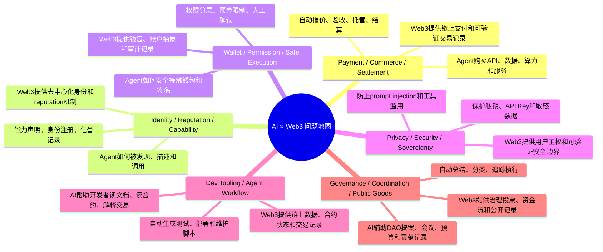
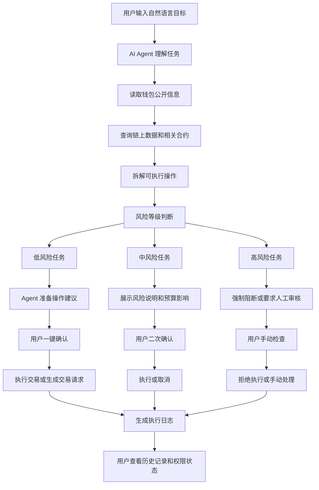
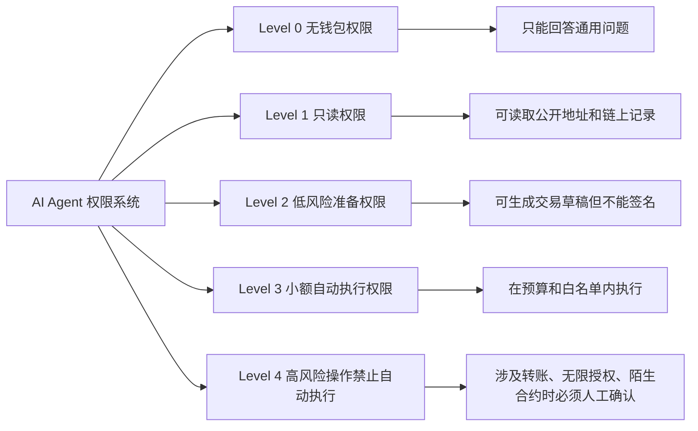
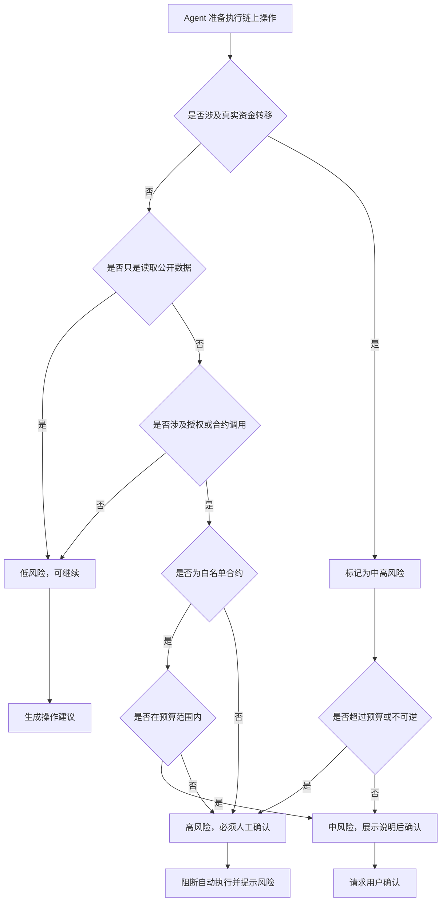

# Week 2｜方向研究｜AI × Web3 问题地图与主方向选择

## 一、任务目标

本次任务的目标是根据 Week 2 Module A，梳理 AI × Web3 的主要交叉方向，理解不同方向中的核心问题、AI 能力与 Web3 机制，并从中选择适合后续深入研究和 proposal 设计的主方向。

AI × Web3 的价值不在于简单地把"大模型"加到链上产品里，也不在于把 Web3 概念包装成 AI 项目。真正有价值的问题，通常出现在以下几个要素的交界处：

> **机器执行 + 经济交换 + 权限控制 + 可验证记录**

也就是说，AI 负责理解、规划、判断、解释和执行任务；Web3 负责身份、资产、权限、交易、记录、协作和信任机制。当两者同时不可替代时，这个方向才更有可能成立。

---

## 二、AI × Web3 问题地图

### 2.1 总体问题地图

### 2.2 六个方向对比表

| 方向 | 核心问题 | AI 的作用 | Web3 的机制 | 适合产出 |
| --- | --- | --- | --- | --- |
| Payment / Commerce / Settlement | Agent 如何购买 API、数据、算力和服务，并完成报价、验收和结算？ | 理解任务需求，自动选择服务，判断交付结果，生成购买或调用请求 | 链上支付、智能合约托管、交易记录、争议处理 | 支付流程图、agent commerce demo、结算协议设计 |
| Identity / Reputation / Capability / Interoperability | Agent 如何被发现、描述、调用、验证和协作？ | 生成能力描述，匹配任务与 agent，解释 agent 能做什么 | 去中心化身份、registry、reputation、能力声明、可验证记录 | Agent profile、能力注册表、信誉系统设计 |
| Wallet / Permission / Safe Execution | Agent 接触钱包、签名、授权和链上动作时，如何避免失控？ | 理解用户目标，解释交易风险，判断操作等级，生成执行建议 | 钱包签名、账户抽象、session key、policy、guard、审计日志 | 钱包权限流程、风险控制方案、产品 demo mock |
| Privacy / Security / Sovereignty | Agent 使用过程中如何保护用户隐私、密钥和敏感信息？ | 识别敏感数据，检测 prompt injection，限制工具滥用 | 私钥自托管、权限隔离、可信执行、链上审计、用户主权 | 安全 checklist、风险模型、本地 agent 方案 |
| Dev Tooling / Agent Workflow | AI 如何真正改善 Web3 builder 的开发流程？ | 阅读文档、解释合约、生成测试脚本、辅助部署和 debug | 链上数据、合约状态、交易历史、开源 repo | 开发者工具、docs-to-agent、交易解释器 |
| Governance / Coordination / Public Goods | AI 如何帮助 DAO 和社区提高协作效率？ | 总结提案、整理会议、追踪贡献、生成预算 checklist | 治理投票、链上资金流、贡献记录、公开透明账本 | DAO 助手、提案总结工具、公共物品追踪面板 |

---

## 三、问题地图中的关键判断

在以上六个方向中，并不是所有方向都适合立刻做成完整项目。判断一个方向是否适合继续深入，可以从以下几个维度考虑：

| 判断维度 | 具体问题 |
| --- | --- |
| 结构性需求 | 这个问题是否长期存在，而不是只因为某个热点项目短暂出现？ |
| 验证可能性 | 是否可以用 demo、流程图、用户访谈、交易记录或 mock 页面验证？ |
| 最小切入点 | 一周内能否做出问题拆解、流程图、README、mock 或最小 prototype？ |
| 风险边界 | 是否涉及私钥、签名、真实资金、身份、敏感数据或不可逆操作？ |
| 后续承接 | 是否能自然进入 Week 3 proposal、Hackathon track 或长期 research backlog？ |

基于我的背景和兴趣，我更适合从**市场营销、产品运营、用户体验和场景设计**角度切入，而不是直接做复杂的底层协议或完整链上实现。因此，我会优先选择能通过用户流程、权限设计、产品规则和风险边界来表达的方向。

---

## 四、两个候选方向分析

### 候选方向一：Wallet / Permission / Safe Execution

#### 1. 方向说明

这个方向关注的是：

> 当 AI agent 能帮助用户执行链上任务时，如何让它"能帮忙"，但"不失控"。

在 Web3 场景中，agent 可能不只是回答问题，还会进一步帮助用户读取钱包、分析收益、准备交易、调用合约，甚至发起签名请求。问题在于，一旦 agent 接触钱包、授权、签名和资金，就会带来明显风险。

例如用户可能对 agent 说：

> "帮我检查一下钱包里有没有可以领取的奖励，如果风险低，就帮我准备 claim。"

这个任务看似简单，但实际包含多个风险点：

- agent 能不能读取用户钱包？
- agent 是否可以自动生成交易？
- 多大金额以内可以自动执行？
- 哪些操作必须用户确认？
- 如果合约有风险，agent 如何提示？
- 如果操作失败，用户如何追踪执行记录？
- 如果 agent 被 prompt injection 攻击，如何防止它越权操作？

因此，这个方向非常适合做成一个产品流程设计：通过权限分层、预算限制、人工确认、风险提示和日志记录，让 agent 可以辅助用户执行链上任务，但不能越权控制用户资产。

#### 2. 目标用户

本方向的目标用户是：

> **普通 Web3 用户，尤其是希望使用 AI 简化链上操作，但又担心钱包和资金安全的用户。**

这类用户通常有以下特点：

- 看不懂复杂交易内容；
- 不理解合约调用细节；
- 担心钱包授权过大；
- 希望 AI 帮忙整理、解释和执行部分操作；
- 不愿意完全把资金控制权交给 agent；
- 希望每一次高风险操作都能获得清晰提醒和确认。

#### 3. AI 的作用

在这个方向中，AI 的主要作用包括：

1. **理解用户目标** — 例如用户说"帮我看看有没有可以 claim 的奖励"，AI 需要理解这是一个链上查询和潜在执行任务。
2. **拆解任务步骤** — AI 可以把用户目标拆解为：连接钱包、读取链上信息、识别可领取项目、判断风险、生成建议、等待确认。
3. **解释交易风险** — AI 可以把复杂的合约调用、授权范围、资金变化解释成用户能理解的语言。
4. **判断操作等级** — AI 可以根据金额、授权范围、合约可信度、操作不可逆程度，把任务分为低风险、中风险和高风险。
5. **生成执行建议** — AI 可以告诉用户："建议只执行 claim，不建议 approve unlimited token allowance。"

#### 4. Web3 的机制

Web3 在这个方向中不可替代，因为它提供了：

1. **钱包连接与签名机制** — 用户最终仍然通过钱包确认关键操作，agent 不能直接绕过用户控制权。
2. **账户抽象与权限控制** — 可以通过 session key、policy、guard 等方式限制 agent 的操作范围。
3. **链上交易记录** — 每一次执行都可以被记录和追踪，便于审计。
4. **预算和权限边界** — 可以限制 agent 每日最多操作多少金额、可调用哪些合约、可执行哪些函数。
5. **可撤销授权** — 用户可以随时关闭 agent 的权限，避免长期风险。

#### 5. 为什么它不是纯 AI 问题？

这个方向不是纯 AI 问题，因为 AI 本身无法解决资产控制和链上执行中的信任问题。

纯 AI 可以解释交易、生成建议、识别风险，但它不能回答以下问题：

- agent 是否有权发起交易？
- agent 能操作多少金额？
- agent 能调用哪些合约？
- 哪些操作必须用户手动确认？
- 权限什么时候过期？
- 用户如何撤销授权？
- 发生争议时如何证明 agent 做过什么？

这些问题必须依赖 Web3 的钱包、签名、权限管理、链上记录和智能合约机制。因此，仅靠 AI 无法完成安全闭环。

#### 6. 为什么它不是纯 Web3 问题？

这个方向也不是纯 Web3 问题，因为传统钱包和合约虽然能提供签名和权限机制，但普通用户很难理解复杂操作。

纯 Web3 工具通常存在以下问题：

- 用户看不懂交易调用内容；
- 用户不知道授权是否危险；
- 用户不知道某个合约是否可信；
- 用户无法把自然语言目标转化成具体链上步骤；
- 用户很难持续监控多个 DeFi、claim、staking 或授权风险；
- 钱包弹窗通常只展示技术信息，缺少上下文解释。

AI 的价值在于帮助用户理解任务、解释风险、生成建议，并把复杂链上操作变成更容易理解的流程。

---

### 候选方向二：Identity / Reputation / Capability / Interoperability

#### 1. 方向说明

这个方向关注的是：

> 在未来存在大量 AI agent 的情况下，用户如何知道一个 agent 是谁、能做什么、是否可信，以及如何调用它。

随着 AI agent 数量增加，用户可能会面对很多不同类型的 agent：

- 有的 agent 擅长查链上数据；
- 有的 agent 擅长解释交易；
- 有的 agent 擅长帮助 DAO 总结提案；
- 有的 agent 擅长执行支付或结算；
- 有的 agent 擅长帮助开发者读合约和文档。

这会带来一个问题：用户如何选择合适的 agent？平台如何展示 agent 的能力？不同 agent 之间如何互相调用？agent 的历史表现如何被记录？

因此，这个方向适合做 agent profile、capability manifest、agent registry 或 reputation system。

#### 2. 目标用户

本方向的目标用户包括：

- AI agent 使用者；
- AI agent 开发者；
- Web3 工具平台；
- DAO 或社区运营者；
- 希望调用第三方 agent 服务的项目方。

#### 3. AI 的作用

AI 在这个方向中的作用包括：

1. **生成 agent 能力描述** — 例如说明某个 agent 能查什么数据、能执行什么任务、需要什么权限。
2. **理解用户需求并匹配 agent** — 用户说"我需要一个帮我总结 DAO 提案的工具"，AI 可以匹配合适的 agent。
3. **辅助 agent 之间协作** — 一个 agent 可以调用另一个 agent，例如"数据查询 agent"把结果交给"总结 agent"。
4. **解释 agent 的可信度** — AI 可以根据历史记录、用户评价、调用成功率等信息生成解释。

#### 4. Web3 的机制

Web3 在这个方向中的作用包括：

1. **去中心化身份** — agent 可以有可验证身份，而不是只依赖某个平台账号。
2. **能力注册表** — agent 的能力、接口、权限要求可以被公开记录。
3. **信誉记录** — agent 的调用历史、服务结果、评价和争议可以被记录。
4. **可组合调用** — 不同 agent 可以通过标准化接口互相调用。
5. **抗平台锁定** — agent 的身份和历史记录不完全依赖某一个中心化平台。

#### 5. 为什么它不是纯 AI 问题？

它不是纯 AI 问题，因为 AI 可以生成能力描述和推荐结果，但无法单独建立开放网络中的可信身份和长期信誉。

如果没有 Web3，agent 的身份、评价和历史记录通常会依赖某个中心化平台。这样会产生几个问题：

- agent 的信誉不能跨平台迁移；
- 用户很难验证历史记录是否被篡改；
- agent 能力声明可能只是自我描述；
- agent 之间缺少开放的发现和调用机制；
- 平台可以单方面改变排序、评价和访问规则。

因此，agent 的身份、能力和信誉需要 Web3 的可验证记录和开放注册机制来支持。

#### 6. 为什么它不是纯 Web3 问题？

它也不是纯 Web3 问题，因为链上身份和记录本身不能自动理解用户需求，也不能自动判断 agent 是否适合某个任务。

如果只有 Web3 registry，用户仍然可能看不懂：

- agent 的能力描述；
- agent 的接口要求；
- agent 的风险等级；
- agent 的调用条件；
- agent 历史表现的实际含义。

AI 的作用是把这些结构化信息转化成用户能理解的推荐、解释和任务匹配结果。因此，这个方向也需要 AI 和 Web3 同时参与。

---

## 五、最终主方向选择

### 5.1 最终选择

我最终选择：

> **Wallet / Permission / Safe Execution**
> 面向普通 Web3 用户的 AI Agent 钱包安全执行方案

作为 Week 2 的主方向。

### 5.2 选择原因

我选择这个方向，主要有以下原因：

第一，这个问题足够真实。AI agent 如果未来要真正进入 Web3 使用场景，就不可避免地会接触钱包、签名、授权和链上操作。但这些操作一旦出错，可能造成真实资产损失。

第二，这个方向同时需要 AI 和 Web3。AI 负责理解用户目标、解释交易风险和生成执行建议；Web3 负责钱包签名、权限控制、链上记录和资产安全。缺少任何一方，这个问题都无法完整解决。

第三，这个方向适合从产品和运营角度切入。即使不直接写合约，也可以通过用户旅程、权限分层、风险提示、确认流程和审计日志来设计一个完整方案。

第四，这个方向便于后续做 proposal。Week 3 可以继续围绕目标用户、核心场景、最小功能、验证方式和风险边界展开。

---

## 六、主方向产品设想

### 6.1 项目名称

**Safe Agent Wallet Assistant**

中文名称：

> **AI Agent 钱包安全执行助手**

### 6.2 一句话介绍

Safe Agent Wallet Assistant 是一个面向普通 Web3 用户的 AI 钱包安全执行方案，通过权限分层、预算限制、人工确认、风险提示和可验证日志，让 AI agent 可以辅助用户完成链上任务，但不能越权控制用户资产。

### 6.3 目标用户

本项目主要面向：

- 普通 Web3 用户；
- 不熟悉合约调用的新手用户；
- 经常参与 claim、staking、swap、airdrop、DeFi 操作的用户；
- 希望用 AI 简化链上操作，但不愿意完全交出钱包控制权的用户。

### 6.4 真实场景

用户打开钱包助手，对 agent 输入：

> "帮我检查一下这个钱包有没有可以领取的奖励。如果风险低，帮我准备 claim 操作，但不要自动花钱。"

Agent 开始执行以下任务：

1. 读取用户钱包公开地址；
2. 查询可能的 claim / reward / staking 信息；
3. 识别相关合约和操作；
4. 分析风险等级；
5. 向用户解释操作内容；
6. 如果是低风险操作，准备交易；
7. 如果涉及授权、转账或高风险合约，必须要求用户确认；
8. 执行后生成日志，方便用户复查。

---

## 七、主方向流程图

### 7.1 用户任务流程图

### 7.2 权限分层设计图

### 7.3 风险判断流程图

---

## 八、最小功能设计

为了让这个方向在 Week 2 阶段可验证，不需要直接做完整链上产品，可以先设计一个最小方案。

### 8.1 最小功能列表

| 功能 | 说明 | 是否必须 |
| --- | --- | --- |
| 钱包只读连接 | 用户输入或连接公开钱包地址，agent 只能读取公开链上数据 | 必须 |
| 自然语言任务输入 | 用户用自然语言说明想完成的任务 | 必须 |
| 任务拆解 | agent 将用户目标拆解为具体步骤 | 必须 |
| 风险分类 | 将操作分为低风险、中风险、高风险 | 必须 |
| 权限分层 | 不同操作对应不同权限等级 | 必须 |
| 人工确认 | 涉及签名、转账、授权时必须用户确认 | 必须 |
| 预算限制 | 限制 agent 可自动处理的金额范围 | 建议 |
| 白名单合约 | 只允许 agent 在可信合约范围内操作 | 建议 |
| 执行日志 | 记录 agent 建议、用户确认和执行结果 | 必须 |
| 权限撤销 | 用户可以随时关闭 agent 权限 | 建议 |

### 8.2 MVP 范围

本阶段的 MVP 不需要真实接入私钥，也不需要处理真实资金。

MVP 可以只做：

1. 一个用户场景说明；
2. 一个钱包权限流程图；
3. 一个风险分级表；
4. 一个 agent 执行日志 mock；
5. 一个 README / Notion 页面；
6. 可选：一个简单前端 mock 页面。

---

## 九、风险分级设计

| 风险等级 | 操作类型 | Agent 是否可自动执行 | 用户确认要求 |
| --- | --- | --- | --- |
| 低风险 | 查询余额、读取交易历史、查看 claim 信息 | 可以 | 不需要签名 |
| 中风险 | 准备 claim、生成 swap 草稿、模拟交易 | 只能准备，不能直接签名 | 需要用户确认 |
| 高风险 | 转账、approve、无限授权、调用陌生合约 | 不可自动执行 | 必须人工确认或直接阻断 |
| 极高风险 | 导出私钥、输入助记词、保存 API Key、绕过钱包确认 | 永远禁止 | 直接拒绝 |

---

## 十、风险边界

本项目必须明确不做以下事情：

1. 不要求用户提交私钥；
2. 不要求用户提交助记词；
3. 不保存 API Key、token 或 .env 文件；
4. 不自动执行高风险交易；
5. 不绕过钱包确认；
6. 不处理真实资金账户；
7. 不对陌生合约进行自动授权；
8. 不承诺 agent 的判断一定正确；
9. 所有涉及资金和签名的操作都必须由用户最终确认。

---

## 十一、验证方式

本方向可以通过以下方式验证：

| 验证方式 | 说明 |
| --- | --- |
| 流程图 | 展示 agent 从理解任务到风险判断再到用户确认的完整流程 |
| 风险分级表 | 证明项目有清晰的权限边界 |
| 用户场景 | 用普通用户 claim / staking / swap 的场景说明真实需求 |
| Mock 页面 | 展示 agent 如何提示风险和请求确认 |
| 执行日志样例 | 展示每一步如何被记录和追踪 |
| 用户访谈 | 询问 Web3 用户是否担心 agent 自动操作钱包 |

---

## 十二、执行日志样例

| 时间 | 用户目标 | Agent 行为 | 风险等级 | 用户操作 | 结果 |
| --- | --- | --- | --- | --- | --- |
| 10:00 | 检查可领取奖励 | 读取钱包公开地址 | 低 | 无需确认 | 成功 |
| 10:01 | 查询 claim 合约 | 发现一个可领取项目 | 低 | 无需确认 | 成功 |
| 10:02 | 准备 claim | 生成交易草稿 | 中 | 用户确认 | 等待签名 |
| 10:03 | 请求签名 | 展示 gas、合约地址和风险说明 | 中 | 用户确认 | 执行成功 |
| 10:04 | 记录结果 | 生成执行日志 | 低 | 无需确认 | 已完成 |

---

## 十三、最终结论

我最终选择 **Wallet / Permission / Safe Execution** 作为 Week 2 主线。

原因是，AI agent 在 Web3 场景中最有价值的能力之一，是帮助用户理解和执行复杂链上任务。但是，一旦 agent 接触钱包、签名、授权和资金，就会带来误操作、越权执行、恶意合约调用和资产损失等风险。因此，这个方向必须同时依赖 AI 和 Web3。

AI 的价值在于理解用户目标、拆解任务、解释交易风险和生成执行建议；Web3 的价值在于提供钱包签名、权限控制、链上记录、预算限制和可撤销授权机制。缺少 AI，普通用户仍然难以理解复杂链上操作；缺少 Web3，agent 又无法形成可靠的权限和资产安全边界。

对我来说，这个方向也更适合从产品和运营角度切入。现阶段不需要直接实现复杂协议或完整合约，而是可以先完成用户场景、权限流程、风险分级、执行日志和产品 mock。后续 Week 3 proposal 可以继续围绕这个方向，进一步设计最小功能、目标用户、验证方式和 Hackathon demo。

