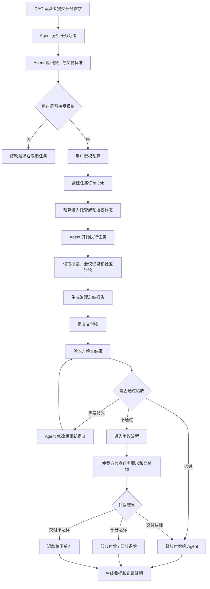
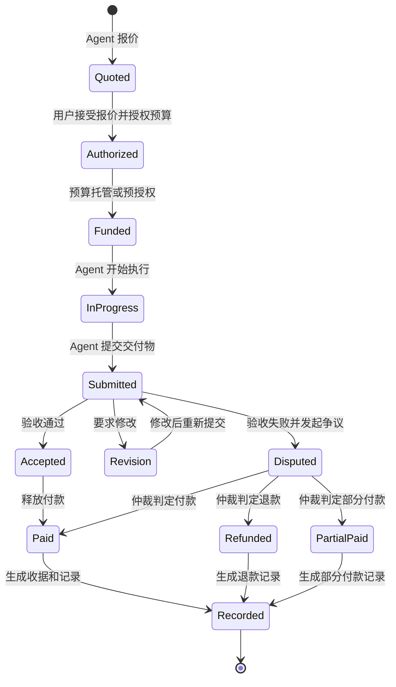
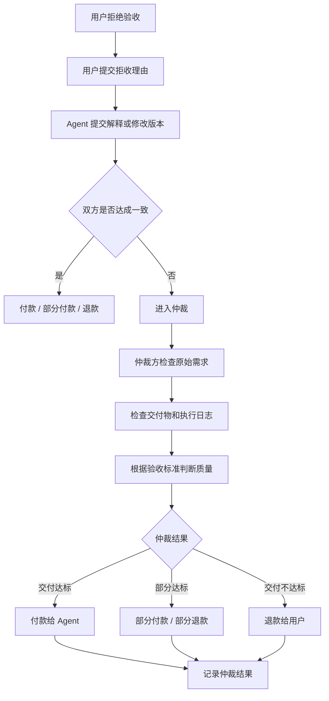
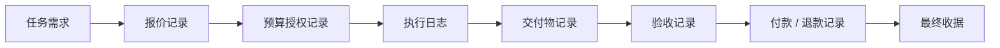
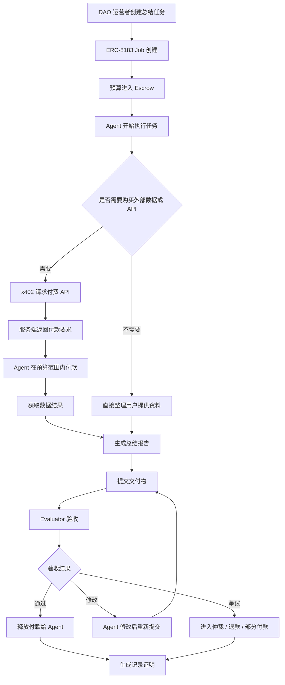

# Week 2｜Payment / Commerce｜最小支付与商业流程拆解

## 题目

# 面向 Web3 社区运营的 DAO Proposal Summary Agent 商业流程设计

---

## 一、任务目标

本次任务根据 Week 2 Module B，选择一个"agent 帮人完成任务并收款"的场景，设计一个最小 payment / commerce flow。

本方案选择的场景是：

> **AI Agent 帮助 DAO / Web3 社区整理治理提案、会议记录和社区讨论内容，并在交付总结报告后收款。**

这个场景与我的市场营销和运营产品方向较相关。因为 Web3 项目不仅需要技术建设，也需要持续进行社区沟通、用户教育、内容传播和治理参与引导。DAO 提案、会议纪要、预算讨论和社区反馈如果没有被清楚整理，就会增加用户理解成本，降低社区参与度。

因此，本方案关注的不是底层协议实现，而是：

* AI agent 如何帮助 Web3 社区降低治理内容整理成本；
* 如何让复杂治理信息更容易被社区成员理解；
* 如何把 agent 服务设计成可报价、可交付、可验收、可付款的商业流程；
* 如何通过记录证明和争议机制，提升服务交易中的信任。

---

# 二、场景选择

## 2.1 场景名称

**DAO Proposal Summary Agent**

中文名称：

> **DAO 提案与社区治理总结 Agent**

---

## 2.2 一句话介绍

DAO Proposal Summary Agent 是一个面向 Web3 社区运营者的 AI 服务。社区运营者可以下单，让 agent 整理 DAO 治理提案、会议记录、论坛讨论和预算信息，并交付一份结构化总结报告。验收通过后，agent 收取服务费用；如果交付质量不达标，则进入修改、退款或争议流程。

---

## 2.3 为什么这个场景与市场营销有关？

这个场景不是传统广告投放意义上的市场营销，而是更偏向 **Web3 社区运营、内容传播、用户教育和服务商业化**。

在 Web3 项目中，社区成员能否理解治理提案、预算安排和项目进展，会直接影响他们是否参与讨论、投票、传播和长期留存。DAO 提案和会议内容往往复杂、分散、篇幅长，普通社区成员很难快速理解。

AI agent 可以帮助社区运营者把复杂内容转化为：

* 简明摘要；
* 关键争议点；
* 支持与反对理由；
* 预算影响；
* 潜在风险；
* 下一步行动项；
* 面向普通社区成员的传播版本。

这些能力本质上服务于 Web3 项目的 **用户教育、社区沟通、治理传播和运营效率提升**，因此与市场营销方向具有较强关联。

---

# 三、用户与角色拆解

## 3.1 目标用户

本方案的目标用户是：

> **DAO / Web3 项目的社区运营者、治理负责人、市场人员或公共物品项目协调者。**

他们的典型痛点包括：

1. 治理提案内容太长，社区成员不愿意阅读；
2. 会议记录分散，行动项不清晰；
3. 预算讨论复杂，普通用户难以理解；
4. 社区运营者需要花大量时间整理内容；
5. 提案传播缺少清晰版本，影响投票参与；
6. 项目方想提高透明度，但缺少高效内容整理工具。

---

## 3.2 五个核心角色

| 问题 | 本方案中的角色 | 说明 |
| ---- | ---- | ---- |
| 谁下单？ | DAO 运营者 / 社区负责人 / 市场人员 | 提交总结需求、上传资料链接、设置预算 |
| 谁执行？ | DAO Proposal Summary Agent | 读取资料，生成治理总结、传播版本和行动项 |
| 谁验收？ | DAO 运营者 / 治理小组成员 | 检查内容是否准确、完整、可读 |
| 谁付款？ | DAO treasury / 项目运营预算钱包 / 社区负责人 | 在验收通过后支付 agent 服务费 |
| 谁仲裁？ | 平台方 / 社区多签小组 / 第三方 evaluator | 当交付质量出现争议时判断付款、退款或部分付款 |

---

# 四、服务内容设计

## 4.1 Agent 提供什么服务？

DAO Proposal Summary Agent 主要提供以下服务：

| 服务模块 | 内容 |
| ---- | ---- |
| 提案总结 | 总结 DAO 治理提案的背景、目标、执行计划 |
| 争议整理 | 提取支持意见、反对意见和社区讨论焦点 |
| 预算解释 | 整理资金用途、预算规模和潜在影响 |
| 风险提醒 | 标出执行风险、治理风险和社区沟通风险 |
| 行动项整理 | 输出谁需要做什么、下一步是什么 |
| 社区传播版本 | 把复杂内容改写成适合社区成员阅读的简洁版本 |
| 投票前摘要 | 帮助成员在投票前快速理解提案核心信息 |

---

## 4.2 交付物格式

本 agent 的最小交付物是一份 Markdown / Notion 格式报告，包含：

1. 提案标题；
2. 一句话摘要；
3. 背景说明；
4. 核心目标；
5. 支持理由；
6. 反对意见；
7. 预算影响；
8. 风险点；
9. 下一步行动项；
10. 面向社区传播的简短版本。

---

# 五、最小 Payment / Commerce Flow

## 5.1 总体流程说明

一个完整的 agent commerce 流程不只是"付款"，而是包括：

> 发现服务 → 提交需求 → 报价 → 预算授权 → 执行任务 → 交付结果 → 验收 → 付款 / 退款 / 争议 → 记录证明

在本场景中，支付只是其中一环。真正重要的是让服务交易过程可控、可验收、可追溯。

---

## 5.2 总体流程图



---

# 六、流程分阶段拆解

## 6.1 阶段一：发现服务

DAO 运营者在 agent marketplace、社区工具页或服务目录中发现 DAO Proposal Summary Agent。

运营者可以看到：

* agent 能做什么；
* 适合什么场景；
* 历史完成任务数量；
* 用户评分；
* 价格范围；
* 交付样例；
* 争议记录；
* 是否支持退款。

这一阶段对应市场营销中的 **服务展示、用户信任建立和转化入口设计**。

---

## 6.2 阶段二：提交需求

DAO 运营者提交任务需求，例如：

> 请帮我们整理最近 3 个治理提案和 1 次社区会议记录，输出一份中文总结。内容需要包括：每个提案的核心目标、支持理由、反对意见、预算影响、潜在风险和下一步行动项。最后请生成一个适合发在社区公告里的简短版本。

用户需要提供：

| 信息 | 示例 |
| ---- | ---- |
| 任务类型 | 治理提案总结 |
| 资料来源 | Forum 链接、会议纪要、Discord 讨论摘要 |
| 输出语言 | 中文 |
| 输出格式 | Markdown / Notion |
| 交付深度 | 简明版 / 标准版 / 深度版 |
| 截止时间 | 30 分钟 / 2 小时 / 24 小时 |
| 预算上限 | 10 USDC |
| 验收人 | 社区运营者或治理小组成员 |

---

## 6.3 阶段三：报价

Agent 根据任务复杂度返回报价。

### 报价样例

| 项目 | 内容 |
| ---- | ---- |
| 服务内容 | 整理 3 个治理提案 + 1 份会议记录 |
| 交付格式 | Markdown / Notion 页面 |
| 交付内容 | 摘要、争议点、预算影响、风险提醒、行动项、社区传播版本 |
| 预计完成时间 | 30 分钟 |
| 报价 | 10 USDC |
| 免费修改次数 | 1 次 |
| 超出范围费用 | 每增加 1 个提案 +2 USDC |
| 退款条件 | 未提交交付物可全额退款；严重不达标可进入仲裁 |
| 验收方式 | DAO 运营者人工验收，必要时第三方 evaluator 仲裁 |

---

## 6.4 阶段四：预算授权

用户接受报价后，需要授权预算。

预算授权不是直接把钱打给 agent，而是明确：

* 最高可支付金额；
* 付款触发条件；
* 任务有效期；
* 是否允许部分付款；
* 是否允许退款；
* 是否需要人工验收；
* 是否允许 agent 使用外部付费 API。

### 预算授权表

| 授权项 | 设置 |
| ---- | ---- |
| 最高预算 | 10 USDC |
| 支付方式 | 验收通过后付款 |
| 预算状态 | 托管 / 预授权 |
| 任务有效期 | 30 分钟 |
| 是否允许自动付款 | 不允许，必须验收通过 |
| 是否允许部分付款 | 允许 |
| 是否允许退款 | 允许 |
| 是否允许 agent 购买外部资料 | 不允许，除非再次确认 |
| 争议处理 | 超过 1 次修改仍不合格，进入仲裁 |

---

## 6.5 阶段五：执行任务

Agent 开始执行任务：

1. 读取用户提供的治理提案；
2. 读取会议记录；
3. 提取核心观点；
4. 分类支持意见和反对意见；
5. 识别预算信息；
6. 总结潜在风险；
7. 生成行动项；
8. 输出社区传播版本；
9. 保存执行日志。

### 执行日志样例

| 时间 | Agent 行为 | 状态 |
| ---- | ---- | ---- |
| 10:00 | 接收任务订单 | 成功 |
| 10:01 | 读取 3 个提案链接 | 成功 |
| 10:05 | 提取提案目标和预算信息 | 成功 |
| 10:12 | 整理支持与反对意见 | 成功 |
| 10:18 | 生成初版总结 | 成功 |
| 10:22 | 生成社区公告版本 | 成功 |
| 10:25 | 提交最终交付物 | 成功 |

---

## 6.6 阶段六：交付

Agent 提交最终交付物。

### 交付物样例结构

```markdown
# DAO 治理提案总结报告

## 1. 本次总结范围
- 提案 A：
- 提案 B：
- 提案 C：
- 会议记录：

## 2. 一句话总览
本轮治理讨论主要围绕资金分配、社区增长和公共物品支持展开。

## 3. 提案摘要
### 提案 A
- 核心目标：
- 支持理由：
- 反对意见：
- 预算影响：
- 潜在风险：
- 下一步行动：

## 4. 主要争议点
- 争议点 1：
- 争议点 2：

## 5. 预算影响
- 涉及金额：
- 资金来源：
- 可能影响：

## 6. 风险提醒
- 执行风险：
- 治理风险：
- 社区沟通风险：

## 7. 下一步行动项
- 谁负责：
- 何时完成：
- 需要社区确认什么：

## 8. 社区公告简短版
适合发到 Discord / Telegram / X 的简短总结。
```

---

## 6.7 阶段七：验收

验收方检查交付结果是否符合标准。

### 验收标准

| 验收项 | 标准 |
| ---- | ---- |
| 完整性 | 是否覆盖所有指定提案和会议记录 |
| 准确性 | 是否没有明显编造、误读或遗漏 |
| 结构性 | 是否包含摘要、争议点、预算影响、风险和行动项 |
| 可读性 | 是否适合社区成员快速理解 |
| 传播价值 | 是否能转化为社区公告或运营内容 |
| 格式 | 是否按约定输出 Markdown / Notion |
| 时效性 | 是否在约定时间内交付 |

---

## 6.8 阶段八：付款 / 修改 / 退款 / 争议

验收后可能出现四种结果：

| 验收结果 | 条件 | 后续处理 |
| ---- | ---- | ---- |
| 通过 | 内容完整、准确、格式符合要求 | 释放全部付款 |
| 需要修改 | 小范围遗漏、表达不清或格式问题 | Agent 免费修改一次 |
| 部分通过 | 大部分完成，但缺少部分内容 | 部分付款，部分退款 |
| 不通过 | 内容严重错误、明显编造、超时严重 | 退款或进入争议 |

---

# 七、状态机设计



---

# 八、争议处理流程

## 8.1 争议出现的情况

争议可能发生在以下场景：

1. 用户认为总结不准确；
2. 用户认为 agent 遗漏重要内容；
3. Agent 认为已经按要求完成；
4. 用户提出超出原始任务范围的新要求；
5. 交付物部分可用，但没有完全达标；
6. Agent 超时，但交付内容仍有价值。

---

## 8.2 争议流程图



---

# 九、付款和退款机制

## 9.1 付款机制

本方案采用：

> **托管支付 + 人工验收后释放付款**

原因是 DAO 总结报告属于内容型服务，质量需要人工判断，不能像 API 调用一样只要返回结果就立即付款。

### 付款规则

| 情况 | 处理方式 |
| ---- | ---- |
| 验收通过 | 全额付款给 agent |
| 验收前取消 | 如果 agent 未开始执行，可全额退款 |
| Agent 已完成部分工作 | 可根据完成比例部分付款 |
| Agent 未交付 | 全额退款 |
| 出现争议 | 暂停付款，等待仲裁 |

---

## 9.2 退款机制

| 情况 | 退款方式 |
| ---- | ---- |
| Agent 未提交任何交付物 | 全额退款 |
| Agent 严重超时且未完成 | 全额退款 |
| 内容严重错误或明显编造 | 全额退款 |
| 内容部分可用 | 部分退款 |
| 用户无理由拒收 | 仲裁后决定是否付款 |

---

# 十、记录证明设计

为了让整个 agent commerce 流程可追溯，需要保存以下记录。

| 记录类型 | 内容 | 作用 |
| ---- | ---- | ---- |
| 任务记录 | 任务标题、需求、资料链接、交付格式 | 证明用户下单内容 |
| 报价记录 | 报价金额、交付时间、修改次数 | 证明双方交易条件 |
| 授权记录 | 预算上限、付款条件、有效期 | 证明用户授权范围 |
| 执行记录 | Agent 读取资料、生成内容、提交时间 | 证明 agent 执行过程 |
| 交付记录 | 报告链接、版本号、内容 hash | 证明交付内容 |
| 验收记录 | 验收人、验收意见、验收结果 | 证明付款触发条件 |
| 支付记录 | 付款金额、退款金额、结算状态 | 证明资金流向 |
| 争议记录 | 拒收理由、仲裁结果、处理方式 | 证明争议处理过程 |
| 收据记录 | 最终状态、时间戳、交易凭证 | 便于复盘和审计 |

---

# 十一、记录证明流程图



---

# 十二、最小产品页面设计

如果做一个最小 demo 或 mock，可以包含以下页面。

## 12.1 服务展示页

展示内容：

* Agent 名称；
* Agent 能力；
* 适合场景；
* 服务价格；
* 交付样例；
* 历史评价；
* 退款规则；
* 立即下单按钮。

---

## 12.2 下单页面

用户填写：

* 任务标题；
* 提案链接；
* 会议记录链接；
* 输出语言；
* 输出格式；
* 截止时间；
* 预算上限；
* 验收人；
* 是否需要社区公告版本。

---

## 12.3 报价确认页

展示：

* 服务范围；
* 预计完成时间；
* 报价；
* 修改次数；
* 退款条件；
* 争议处理方式；
* 授权预算按钮。

---

## 12.4 交付验收页

展示：

* Agent 交付报告；
* 摘要预览；
* 执行日志；
* 验收标准 checklist；
* 通过按钮；
* 要求修改按钮；
* 发起争议按钮。

---

## 12.5 收据和记录页

展示：

* 任务 ID；
* 报价；
* 预算授权；
* 验收结果；
* 付款 / 退款状态；
* 时间戳；
* 交付物 hash；
* 评价入口。

---

# 十三、为什么这不是普通支付？

如果只是用户点按钮购买 AI 总结服务，这只是普通 SaaS 付款，不一定体现 agent commerce 的价值。

本方案的重点在于：

1. **付款前有报价** — Agent 需要根据任务范围生成报价，而不是统一固定收费。
2. **付款前有预算授权** — 用户不是无限支付，而是设定最高预算和付款条件。
3. **服务中有执行过程** — Agent 要完成真实任务，而不是只返回一个简单结果。
4. **交付后有验收** — 用户需要判断内容是否达标，付款与验收结果绑定。
5. **失败后有退款和争议处理** — 如果服务质量不达标，需要有补救机制。
6. **全流程有记录证明** — 报价、授权、交付、验收和付款都需要可追溯。

因此，这不是简单支付按钮，而是一个最小 agent commerce 系统。

---

# 十四、为什么这个场景适合市场营销方向？

这个场景适合市场营销和运营产品方向，主要有四点原因。

## 14.1 它服务于社区运营

DAO 和 Web3 项目依赖社区共识。治理提案、会议记录和预算讨论如果不能被清楚传播，社区成员就难以参与讨论和投票。Agent 的总结服务可以帮助运营者提高社区信息透明度。

## 14.2 它降低用户理解成本

市场营销的核心之一是让用户理解价值。DAO 治理内容往往很复杂，agent 可以把长文本转化成普通用户能看懂的版本，提升传播效率。

## 14.3 它可以成为 B2B / B2Community 服务

该 agent 可以面向 DAO、Web3 项目方、公共物品组织、社区运营团队收费，因此具有服务商业化空间。

## 14.4 它包含完整商业流程

本方案涉及服务展示、用户下单、报价、预算授权、交付、验收、付款、退款和复购评价，符合市场营销中的用户转化、服务交付和客户关系管理逻辑。

---

# 十五、协议对比：x402 与 ERC-8183

本部分选择比较 **x402** 与 **ERC-8183**。两者都可以用于 agent commerce，但它们解决的是不同环节。

---

## 15.1 x402 解决什么？

x402 更适合解决：

> **Agent 如何为某个 API、数据接口或数字资源自动付款。**

例如在本场景中，DAO Proposal Summary Agent 可能需要访问一个付费数据接口，比如：

* 付费 governance data API；
* 付费 forum archive；
* 付费 AI inference API；
* 付费链上分析接口。

这时，x402 可以让服务端返回付款要求，agent 在预算范围内完成付款后，再获取资源。

### x402 在本方案中的位置

| 环节 | x402 的作用 |
| ---- | ---- |
| 访问付费 API | 服务端返回付款要求 |
| Agent 自动付款 | 在预算授权范围内完成小额支付 |
| 获取数据 | 付款后获得接口结果 |
| 记录付款 | 生成 API 访问付款证明 |

### x402 的优势

* 适合机器对机器的小额支付；
* 适合 API、数据、内容访问；
* 流程简单；
* 对 agent 自动购买外部资源很有帮助。

### x402 的不足

* 不负责复杂任务验收；
* 不直接处理内容质量争议；
* 不解决长期信誉问题；
* 更像 payment / paywall 层，而不是完整 commerce 层。

---

## 15.2 ERC-8183 解决什么？

ERC-8183 更适合解决：

> **Agent 接受一个任务，提交交付物，由 evaluator 验收，并通过 escrow 完成结算。**

这与本方案的 DAO Proposal Summary Agent 更接近。因为本场景不是简单买一个 API，而是完成一个内容型任务，需要报价、托管、交付、验收和付款。

### ERC-8183 在本方案中的位置

| 环节 | ERC-8183 的作用 |
| ---- | ---- |
| 创建任务 | 将总结任务记录为 Job |
| 预算托管 | 将服务费用放入 escrow |
| Agent 执行 | Agent 根据 Job 要求完成任务 |
| 提交交付物 | Agent 提交总结报告 |
| Evaluator 验收 | 判断任务是否完成 |
| 结算 | 验收通过后释放付款 |
| 失败处理 | 可扩展退款、争议和终止逻辑 |

### ERC-8183 的优势

* 适合任务型 agent commerce；
* 支持 job 和 escrow 思路；
* 更适合交付物验收；
* 能帮助形成完整结算流程。

### ERC-8183 的不足

* 对用户体验要求较高；
* 需要配合 evaluator、reputation 或 dispute 机制；
* 对普通运营者来说，可能需要产品层包装才能易用。

---

## 15.3 x402 与 ERC-8183 对比表

| 对比维度 | x402 | ERC-8183 |
| ---- | ---- | ---- |
| 主要解决问题 | 如何为 API / 数据 / 数字资源付款 | 如何围绕任务进行托管、交付、验收和结算 |
| 更偏向 | Payment / Paywall | Commerce / Escrow / Settlement |
| 典型场景 | 付费 API、AI 推理接口、数据访问 | Agent 服务、任务外包、内容交付、验收结算 |
| 是否适合本场景 | 适合作为外部资源购买工具 | 适合作为整体任务结算框架 |
| 是否强调预算授权 | 可以配合预算使用 | 更适合作为任务预算的一部分 |
| 是否强调交付验收 | 较弱 | 较强 |
| 是否解决争议 | 较弱，需要外部机制 | 可以扩展争议处理 |
| 在本方案中的角色 | Agent 执行过程中购买外部资源 | DAO 下单、托管预算、验收交付、释放付款 |

---

# 十六、x402 + ERC-8183 组合方案

在完整方案中，x402 和 ERC-8183 可以组合使用。



在这个组合中：

* **x402** 解决 agent 购买外部数据、API 或 AI 推理资源的问题；
* **ERC-8183** 解决整体任务的创建、预算托管、交付验收和结算问题；
* 两者结合后，可以覆盖更完整的 agent commerce 流程。

---

# 十七、最小可行版本 MVP

## 17.1 本阶段不需要做什么

本阶段不需要：

* 不需要真实连接钱包；
* 不需要处理真实资金；
* 不需要部署合约；
* 不需要保存私钥；
* 不需要接入真实 API Key；
* 不需要实现完整仲裁系统。

---

## 17.2 本阶段需要完成什么

本阶段可以完成：

1. 一个完整 README / Notion 页面；
2. 一个 agent commerce 流程图；
3. 一个角色拆解表；
4. 一个报价样例；
5. 一个预算授权样例；
6. 一个验收标准表；
7. 一个付款 / 退款 / 争议机制；
8. 一个 x402 与 ERC-8183 对比表；
9. 一个最小产品页面 mock 说明。

---

# 十八、最终总结

本方案选择 **面向 Web3 社区运营的 DAO Proposal Summary Agent** 作为 Payment / Commerce / Settlement 的最小场景。

该场景中，AI agent 帮助 DAO 或 Web3 社区完成治理提案、会议记录和社区讨论内容的整理，并通过明确的报价、预算授权、执行、交付、验收、付款、退款和争议机制形成商业闭环。

这个方向与市场营销和运营产品方向有较强关系。因为它解决的是 Web3 社区中的信息传播、用户教育、治理参与和运营效率问题。Agent 不只是生成内容，而是作为一种可购买、可交付、可验收的社区运营服务存在。

本方案说明，agent commerce 的核心不是"自动付款"，而是：

> 在明确授权、预算控制、交付标准、验收规则和可追溯记录下，让 agent 服务能够被购买、被信任、被评价和被持续使用。

在协议层面，x402 更适合解决 agent 访问付费 API 或数据资源时的机器支付问题；ERC-8183 更适合解决任务型 agent 服务中的 job、escrow、交付、验收和结算问题。对于本场景来说，x402 可以作为 agent 执行过程中的资源购买工具，ERC-8183 可以作为整体任务的商业流程和结算框架。
