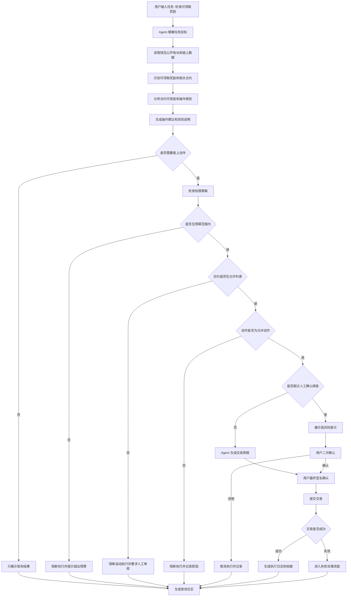
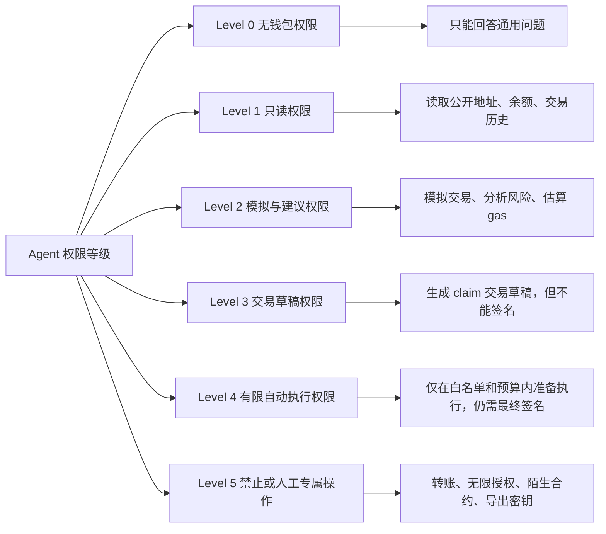
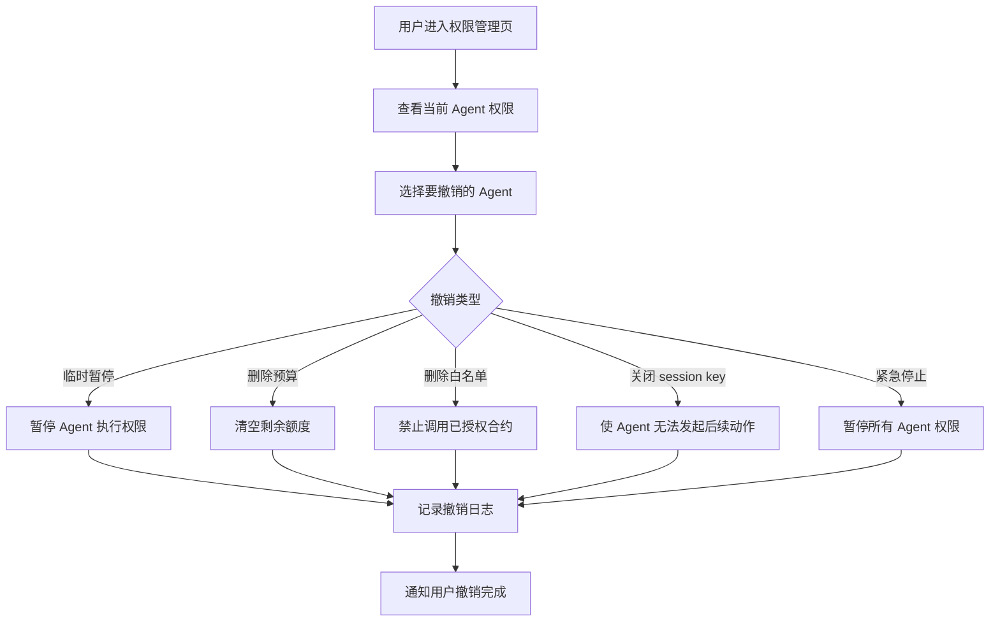
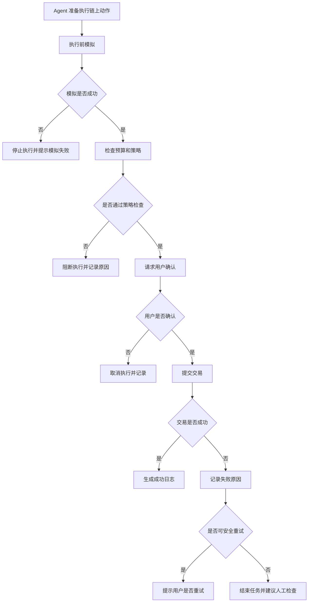
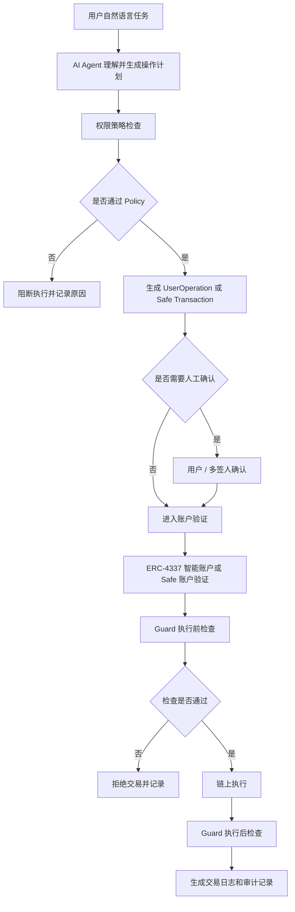

# Week 2｜Wallet / Permission｜Agent 链上动作权限策略

## 题目

# 面向普通 Web3 用户的 AI Agent 链上动作权限策略设计

---

## 一、任务目标

本次任务根据 Week 2 Module D，设计一个"agent 发起链上动作"的执行流程，并区分哪些步骤可以自动化，哪些步骤必须由人确认。

本方案选择的场景是：

> **AI Agent 帮助用户检查钱包中的可领取奖励，并在权限范围内准备 claim 操作。**

这个场景属于 **Wallet / Permission / Safe Execution** 方向。它的核心不是让 agent 完全代替用户操作钱包，而是让 agent 在明确预算、权限边界、人工确认和日志记录的前提下，帮助用户降低链上操作的复杂度。

---

# 二、场景设定

## 2.1 场景名称

**Safe Claim Agent**

中文名称：

> **安全奖励领取 Agent**

---

## 2.2 一句话介绍

Safe Claim Agent 是一个帮助普通 Web3 用户检查钱包奖励、分析 claim 风险、准备交易草稿，并在用户确认后发起链上动作的 agent wallet 场景。它可以自动完成读取、分析和低风险建议，但涉及签名、授权、资金转移或陌生合约调用时，必须由用户人工确认。

---

## 2.3 目标用户

本方案面向：

* 普通 Web3 用户；
* 不熟悉合约调用的新手用户；
* 经常参与 airdrop、staking、claim、reward 的用户；
* 希望使用 AI 简化链上操作，但担心钱包安全的用户；
* 不希望 agent 直接拥有完整钱包控制权的用户。

---

## 2.4 用户痛点

普通 Web3 用户在 claim / staking / DeFi 操作中经常遇到以下问题：

1. 看不懂合约调用内容；
2. 不知道某个 claim 是否真实；
3. 容易误点钓鱼网站；
4. 不知道授权范围是否过大；
5. 不知道交易是否涉及真实资金转移；
6. 事后难以追踪 agent 做过什么；
7. 担心 AI agent 越权操作钱包。

因此，agent wallet 的核心不是"自动执行越多越好"，而是：

> **在可控权限内自动化，在高风险节点强制人工确认。**

---

# 三、Agent 链上动作执行流程图

## 3.1 总体流程图

---

## 3.2 自动化与人工确认边界

| 流程步骤 | 是否可自动化 | 是否需要人工确认 | 原因 |
| ---- | ---- | ---- | ---- |
| 理解用户任务 | 可以 | 不需要 | 只是自然语言理解，不触碰资产 |
| 读取公开钱包地址 | 可以 | 首次连接需要确认 | 读取公开链上数据，风险较低 |
| 查询可领取奖励 | 可以 | 不需要 | 只读操作，无资金风险 |
| 分析合约可信度 | 可以 | 不需要 | 属于风险提示和信息整理 |
| 生成操作建议 | 可以 | 不需要 | 不直接执行交易 |
| 生成交易草稿 | 可以 | 需要展示给用户 | 已经接近链上执行，需要用户知道内容 |
| 低金额 claim | 半自动 | 需要最终签名 | 即使低风险，也涉及链上交易 |
| approve 授权 | 不应自动执行 | 必须人工确认 | 授权可能带来资产风险 |
| token 转账 | 不应自动执行 | 必须人工确认 | 涉及真实资产转移 |
| 调用陌生合约 | 不应自动执行 | 必须人工确认 | 合约风险未知 |
| 无限授权 | 禁止自动执行 | 必须阻断或强提醒 | 极高风险 |
| 导出私钥 / 助记词 | 永远禁止 | 不允许 | 违反安全边界 |
| 撤销权限 | 可由用户发起 | 需要用户确认 | 改变 agent 权限状态 |
| 查看日志 | 可以 | 不需要 | 只读记录 |

---

# 四、权限策略设计

## 4.1 权限策略目标

本权限策略的目标是让 agent 可以帮助用户完成低风险链上任务，但不能绕过用户控制权。

核心原则：

1. **最小权限原则**：agent 只能获得完成当前任务所需的最低权限；
2. **预算限制原则**：agent 不能超过用户设定的金额上限；
3. **白名单原则**：agent 只能调用被允许的合约；
4. **动作限制原则**：agent 只能执行被允许的函数类型；
5. **人工确认原则**：涉及资金、授权和高风险动作时必须人工确认；
6. **可撤销原则**：用户随时可以关闭 agent 权限；
7. **可审计原则**：所有建议、草稿、确认和执行结果都必须记录。

---

## 4.2 权限策略总表

| 策略项 | 设置 |
| ---- | ---- |
| 场景 | Agent 帮助用户检查并准备 claim 奖励 |
| 预算上限 | 每日最多 5 USDC gas 预算；单次 claim 相关成本不超过 2 USDC |
| 可调用合约 | 只允许调用白名单 reward / staking / airdrop 合约 |
| 可执行动作 | read、simulate、prepare claim、submit claim after user signature |
| 禁止动作 | transfer、approve unlimited、delegatecall、withdraw all、export key |
| 人工确认阈值 | 涉及签名、授权、转账、超过 2 USDC gas、陌生合约时必须确认 |
| 自动化范围 | 查询、分析、模拟、生成交易草稿、风险说明 |
| 用户确认范围 | 钱包连接、签名、授权、转账、高风险合约调用 |
| 撤销方式 | 用户可在钱包设置页关闭 session key / agent permission / Safe module |
| 日志记录 | 记录任务、权限检查、风险判断、用户确认、交易 hash、失败原因 |
| 失败处理 | 超预算、合约不在白名单、交易失败、用户拒绝、模拟失败均停止执行并记录 |

---

# 五、权限等级设计

---

## 5.1 权限等级表

| 权限等级 | Agent 可以做什么 | 是否需要人工确认 | 示例 |
| ---- | ---- | ---- | ---- |
| Level 0 无钱包权限 | 回答通用问题 | 不需要 | "什么是 claim？" |
| Level 1 只读权限 | 读取公开地址、余额、交易历史 | 首次连接需要 | 查看钱包是否有可领取奖励 |
| Level 2 模拟与建议权限 | 模拟交易、估算 gas、分析风险 | 不需要 | 模拟 claim 是否会失败 |
| Level 3 交易草稿权限 | 生成交易草稿 | 需要用户查看 | 准备 claim calldata |
| Level 4 有限执行权限 | 在白名单、预算、时间窗口内发起请求 | 仍需用户最终签名 | 低风险 claim |
| Level 5 人工专属操作 | Agent 不得自动执行 | 必须人工确认或阻断 | transfer、approve、陌生合约调用 |

---

# 六、具体策略细节

## 6.1 预算策略

| 预算项 | 限制 |
| ---- | ---- |
| 每日 gas 预算 | 不超过 5 USDC |
| 单次操作 gas 预算 | 不超过 2 USDC |
| 单日最大 claim 次数 | 不超过 3 次 |
| 允许自动准备交易数量 | 每日不超过 5 个交易草稿 |
| 超预算处理 | 自动阻断，要求用户重新授权 |
| 预算有效期 | 24 小时 |
| 预算撤销 | 用户可随时撤销 |

### 为什么需要预算？

预算限制可以防止 agent 在异常情况下反复提交交易、浪费 gas，或被恶意 prompt / 工具调用诱导执行过多操作。

---

## 6.2 可调用合约策略

| 合约类型 | 是否允许 | 说明 |
| ---- | ---- | ---- |
| 白名单 reward 合约 | 允许 | 已知项目的奖励领取合约 |
| 白名单 staking 合约 | 允许 | 用户明确授权的 staking 项目 |
| 官方 airdrop 合约 | 允许 | 需要验证来源 |
| 陌生合约 | 不允许自动执行 | 必须人工审核 |
| 新部署合约 | 不允许自动执行 | 风险较高 |
| 代理合约 / upgradeable 合约 | 需要额外提示 | 可能存在逻辑升级风险 |
| 黑名单合约 | 禁止 | 直接阻断 |

### 合约白名单样例

| 合约名称 | 地址 | 允许动作 | 风险等级 |
| ---- | ---- | ---- | ---- |
| Project A Reward | 0x...demo1 | claim() | 低 |
| Project B Staking | 0x...demo2 | claimRewards() | 中 |
| Project C Airdrop | 0x...demo3 | claim(address,uint256) | 中 |

> 说明：以上地址为示例，不提交真实资金账户和敏感信息。

---

## 6.3 可执行动作策略

| 动作类型 | 是否允许 agent 自动处理 | 是否需要人工确认 | 说明 |
| ---- | ---- | ---- | ---- |
| read balance | 允许 | 不需要 | 只读 |
| read reward info | 允许 | 不需要 | 只读 |
| simulate transaction | 允许 | 不需要 | 不上链 |
| estimate gas | 允许 | 不需要 | 不改变状态 |
| prepare claim | 允许 | 需要用户查看 | 生成交易草稿 |
| submit claim | 半自动 | 需要钱包签名 | 由用户最终确认 |
| approve token | 不允许自动执行 | 必须确认 | 资产授权风险 |
| approve unlimited | 禁止 | 必须阻断 | 极高风险 |
| transfer token | 不允许自动执行 | 必须确认 | 真实资产转移 |
| swap | 不建议自动执行 | 必须确认 | 价格滑点和资金风险 |
| withdraw all | 禁止自动执行 | 必须确认 | 高风险 |
| delegatecall | 禁止 | 阻断 | 可能带来严重安全风险 |
| export private key | 永远禁止 | 不允许 | 触碰私钥红线 |

---

## 6.4 人工确认阈值

以下情况必须由用户人工确认：

1. 任何需要钱包签名的操作；
2. 任何 token 转账；
3. 任何 approve 授权；
4. 单次 gas 预计超过 2 USDC；
5. 单日累计 gas 超过 5 USDC；
6. 调用不在白名单中的合约；
7. 调用 upgradeable / proxy 合约；
8. 操作结果不可逆；
9. claim 之外的函数调用；
10. agent 对风险判断不确定；
11. 交易模拟失败；
12. 用户此前没有授权过该任务。

### 人工确认页面应展示

| 展示项 | 内容 |
| ---- | ---- |
| 操作类型 | claim / approve / transfer / swap |
| 合约地址 | 目标合约 |
| 函数名称 | 将被调用的方法 |
| 资金影响 | 是否转出资产 |
| 授权影响 | 是否增加 allowance |
| gas 预估 | 预计成本 |
| 风险等级 | 低 / 中 / 高 |
| Agent 建议 | 建议执行 / 建议谨慎 / 不建议执行 |
| 用户选项 | 确认 / 拒绝 / 查看详情 |

---

# 七、撤销方式设计

用户必须能随时撤销 agent 权限。

## 7.1 撤销入口

| 撤销方式 | 说明 |
| ---- | ---- |
| 钱包设置页撤销 | 在钱包中关闭 agent session |
| Agent 管理页撤销 | 在 agent 权限页面关闭该 agent |
| Safe 模块禁用 | 如果使用 Safe module，可禁用对应模块 |
| Policy 删除 | 删除该 agent 的预算和合约白名单 |
| Session key 过期 | 到期自动失效 |
| 紧急暂停 | 用户一键暂停所有 agent 动作 |

---

## 7.2 撤销流程图

---

# 八、日志记录设计

## 8.1 为什么需要日志？

Agent wallet 场景的风险不只在于"是否执行成功"，还在于事后能否回答：

* agent 为什么执行这个动作？
* 用户是否确认过？
* 当时权限策略是什么？
* 是否超过预算？
* 调用了哪个合约？
* 交易是否成功？
* 如果失败，失败原因是什么？

因此，日志是 agent wallet 的核心安全组件。

---

## 8.2 日志字段

| 日志字段 | 说明 |
| ---- | ---- |
| Task ID | 本次任务编号 |
| User Intent | 用户原始目标 |
| Agent Decision | Agent 的判断和建议 |
| Permission Check | 权限检查结果 |
| Budget Check | 预算检查结果 |
| Contract Check | 合约白名单检查结果 |
| Action Type | 操作类型 |
| Risk Level | 风险等级 |
| Human Confirmation | 用户是否确认 |
| Transaction Hash | 交易 hash，如有 |
| Execution Result | 成功 / 失败 / 取消 |
| Failure Reason | 失败原因 |
| Timestamp | 时间戳 |

---

## 8.3 日志样例

| 时间 | 用户目标 | Agent 行为 | 权限检查 | 用户确认 | 结果 |
| ---- | ---- | ---- | ---- | ---- | ---- |
| 10:00 | 检查可领取奖励 | 读取公开地址 | 通过 | 不需要 | 成功 |
| 10:02 | 查询 reward 合约 | 识别 claim 机会 | 通过 | 不需要 | 成功 |
| 10:04 | 准备 claim | 生成交易草稿 | 通过 | 需要确认 | 等待用户 |
| 10:05 | 用户确认 claim | 提交交易 | 通过 | 已确认 | 成功 |
| 10:06 | 记录结果 | 保存交易 hash | 通过 | 不需要 | 完成 |

---

# 九、失败处理策略

## 9.1 失败类型与处理

| 失败情况 | 处理方式 | 是否继续执行 |
| ---- | ---- | ---- |
| 超出预算 | 阻断执行，提示用户重新授权 | 否 |
| 合约不在白名单 | 阻断自动执行，要求人工审核 | 否 |
| 动作不在允许列表 | 阻断执行并记录原因 | 否 |
| 用户拒绝签名 | 取消任务，记录用户拒绝 | 否 |
| 交易模拟失败 | 不提交交易，提示失败原因 | 否 |
| gas 价格异常 | 暂停执行，等待用户确认 | 否 |
| 交易上链失败 | 记录失败原因，建议重试或取消 | 视情况 |
| RPC / 网络错误 | 暂停任务，稍后重试 | 可重试 |
| Agent 判断不确定 | 降级为人工确认 | 否 |
| 检测到钓鱼风险 | 阻断并发出高风险警告 | 否 |

---

## 9.2 失败处理流程图

---

# 十、ERC-4337、Safe、Guard / Policy 为什么重要？

## 10.1 ERC-4337 为什么重要？

ERC-4337 的核心价值是 **账户抽象 Account Abstraction**。它让用户账户可以从传统 EOA 私钥账户，变成更灵活的智能合约账户。ERC-4337 通过 UserOperation、Bundler、EntryPoint 等组件，在不修改以太坊共识层的前提下实现账户抽象。([Ethereum Improvement Proposals][1])

在 agent wallet 场景中，ERC-4337 重要的原因是：

1. **支持智能账户** — 用户的钱包不再只是一个私钥控制的账户，而可以加入自定义验证逻辑。
2. **支持 UserOperation** — Agent 可以准备 UserOperation，但是否通过验证可以由智能账户规则决定。
3. **支持 Paymaster** — 某些场景下可以由第三方支付 gas，降低用户操作门槛。
4. **支持更灵活的权限设计** — session key、时间窗口、预算限制、函数限制等都可以作为账户逻辑的一部分。
5. **降低私钥暴露风险** — Agent 不需要拿到用户私钥，只需要在授权范围内生成操作请求。

### ERC-4337 主要解决的风险

| 风险 | ERC-4337 如何帮助 |
| ---- | ---- |
| 私钥单点风险 | 用智能账户逻辑替代单一私钥控制 |
| Agent 越权执行 | 可以在账户验证逻辑中限制 UserOperation |
| 复杂签名体验 | 可以支持更灵活的钱包 UX |
| gas 支付门槛 | Paymaster 可支持代付或赞助 gas |
| 自动化不可控 | UserOperation 可以先验证，再执行 |

简单来说，ERC-4337 让钱包从"钥匙"变成"可编程账户"。这对 agent wallet 很重要，因为 agent 需要的不是无限控制权，而是被规则约束的有限操作权。

---

## 10.2 Safe 为什么重要？

Safe 是一种广泛使用的智能账户 / 多签钱包基础设施。它的意义在于，资金不再只由单个私钥控制，而可以通过多签、模块和权限扩展来管理。Safe Modules 可以为 Safe Smart Account 扩展额外功能，并将模块逻辑与 Safe 核心合约分离；Safe Guards 则可以在交易执行前后进行检查。([Safe Docs][2])

在 agent wallet 场景中，Safe 重要的原因是：

1. **多签控制** — 高风险操作可以要求多个签名人确认，而不是 agent 或单个用户决定。
2. **模块化扩展** — 可以通过 module 给 agent 开放有限能力，而不是开放整个钱包。
3. **适合团队和 DAO 钱包** — 对 DAO、项目方、运营预算钱包尤其重要。
4. **支持权限隔离** — Agent 可以被限制在某个模块或策略内执行任务。
5. **便于审计和管理** — Safe 账户的交易、模块和权限更容易被组织管理。

### Safe 主要解决的风险

| 风险 | Safe 如何帮助 |
| ---- | ---- |
| 单人误操作 | 多签确认降低单点决策风险 |
| Agent 直接控制资金 | Agent 只能通过模块或授权范围执行 |
| 团队资金管理混乱 | 多签和权限管理提升治理透明度 |
| 高风险交易失控 | 可设置多签门槛或模块限制 |
| 事后追责困难 | Safe 交易和模块操作便于追踪 |

简单来说，Safe 更适合管理团队、DAO 或项目方钱包。对于 agent 来说，它可以提供一个"有限入口"，而不是把整个钱包交给 agent。

---

## 10.3 Guard / Policy 机制为什么重要？

Guard / Policy 机制的核心作用是：

> **在交易执行前和执行后检查规则，确保 agent 的动作没有越界。**

Safe Guards 可以给 Safe Smart Accounts 增加可编程的执行前和执行后检查，用来执行自定义交易限制；这些检查可以在执行前验证交易参数和上下文，也可以在执行后检查 Safe 的最终状态。([docs.safefoundation.org][3])

在 agent wallet 场景中，Guard / Policy 可以检查：

* 是否超过预算；
* 合约是否在白名单；
* 函数是否被允许；
* 是否涉及 token 转账；
* 是否存在无限授权；
* 是否超过时间窗口；
* 是否需要人工确认；
* 执行后资产变化是否异常。

### Guard / Policy 主要解决的风险

| 风险 | Guard / Policy 如何帮助 |
| ---- | ---- |
| Agent 调用陌生合约 | 检查目标合约是否在白名单 |
| Agent 执行未授权函数 | 检查 function selector 是否允许 |
| 超预算操作 | 检查 gas、金额和每日限额 |
| 无限授权风险 | 阻断 approve unlimited |
| Prompt injection 导致越权 | 即使 agent 被诱导，policy 也会阻断越权交易 |
| 执行后状态异常 | post-check 检查资产变化是否符合预期 |

简单来说，Guard / Policy 是 agent wallet 的"安全闸门"。它不依赖 agent 自己说安全，而是用规则在执行层面限制 agent。

---

# 十一、三者如何组合使用？

ERC-4337、Safe 和 Guard / Policy 不是互相替代，而是可以组合成一套 agent wallet 安全架构。

## 组合解释

| 组件 | 在本方案中的作用 |
| ---- | ---- |
| AI Agent | 理解用户目标，生成操作计划和风险说明 |
| Policy | 在产品层检查预算、合约、动作和阈值 |
| ERC-4337 | 提供可编程智能账户和 UserOperation 流程 |
| Safe | 提供多签、模块化账户和组织级资金管理 |
| Guard | 在执行前后进行链上 / 账户层检查 |
| 日志系统 | 记录所有决策、确认和交易结果 |

---

# 十二、最小可行方案 MVP

## 12.1 本阶段不做什么

本阶段不需要：

* 不需要连接真实钱包；
* 不需要提交真实交易；
* 不需要处理真实资金；
* 不需要保存私钥；
* 不需要保存助记词；
* 不需要接入真实 API Key；
* 不需要部署合约。

---

## 12.2 本阶段可以完成什么

本阶段可以完成：

1. 一个 agent 链上动作执行流程图；
2. 一个自动化 / 人工确认边界表；
3. 一个权限策略表；
4. 一个预算限制设计；
5. 一个可调用合约和可执行动作范围；
6. 一个撤销方式设计；
7. 一个日志记录样例；
8. 一个失败处理流程；
9. 一个 ERC-4337 / Safe / Guard-policy 解释表。

---

# 十三、最终总结

本方案选择 **Safe Claim Agent** 作为 agent wallet 场景，设计了一个帮助用户检查可领取奖励并准备 claim 操作的权限策略。

该方案的核心观点是：

> Agent 可以自动完成查询、分析、模拟和交易草稿生成，但涉及签名、授权、转账、陌生合约调用、超预算或高风险动作时，必须由人确认或直接阻断。

在权限策略上，本方案设置了预算上限、可调用合约白名单、可执行动作范围、人工确认阈值、撤销方式、日志记录和失败处理机制。

ERC-4337 的价值在于让钱包变成可编程智能账户，使 agent 的链上动作可以被 UserOperation 和账户验证逻辑约束。Safe 的价值在于提供多签、模块化账户和组织级权限管理，适合 DAO 或团队资金场景。Guard / Policy 的价值在于作为执行前后的安全闸门，防止 agent 超预算、越权调用、无限授权或误触发高风险交易。

因此，agent wallet 的关键不是让 AI 拥有更大控制权，而是让 AI 在明确边界内帮助用户，同时把最终控制权、撤销权和审计权保留给用户。

[1]: https://eips.ethereum.org/EIPS/eip-4337 "ERC-4337: Account Abstraction Using Alt Mempool"
[2]: https://docs.safe.global/advanced/smart-account-modules "Safe Modules - Safe Docs"
[3]: https://docs.safefoundation.org/smart-account/guards "Guards - Safe Docs"
