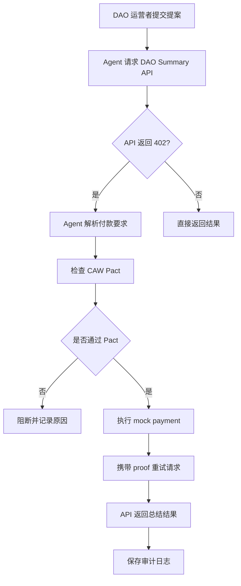
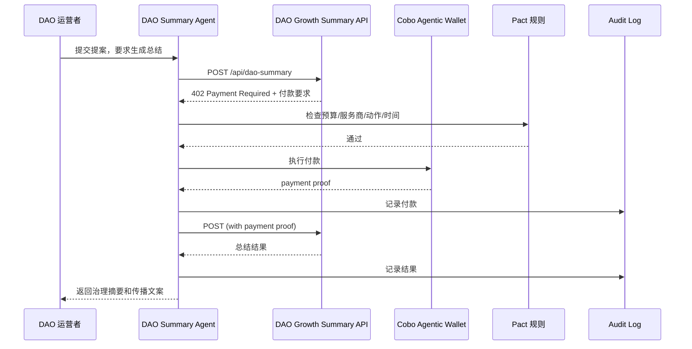
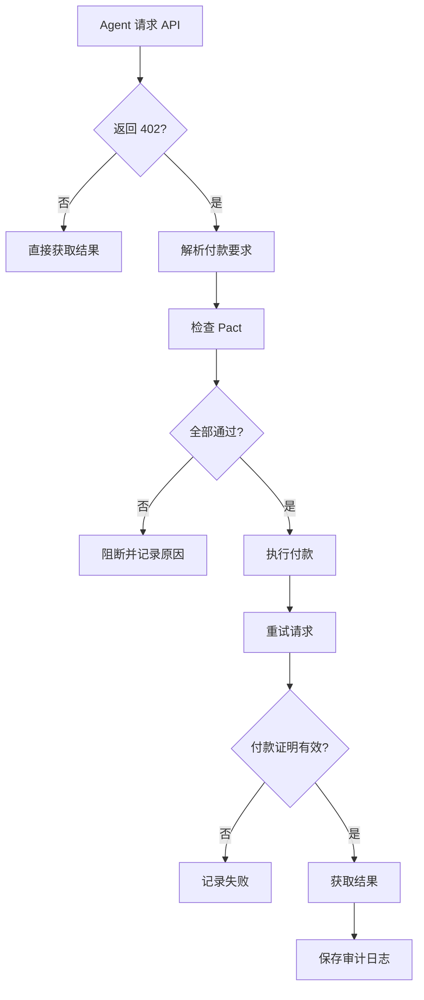
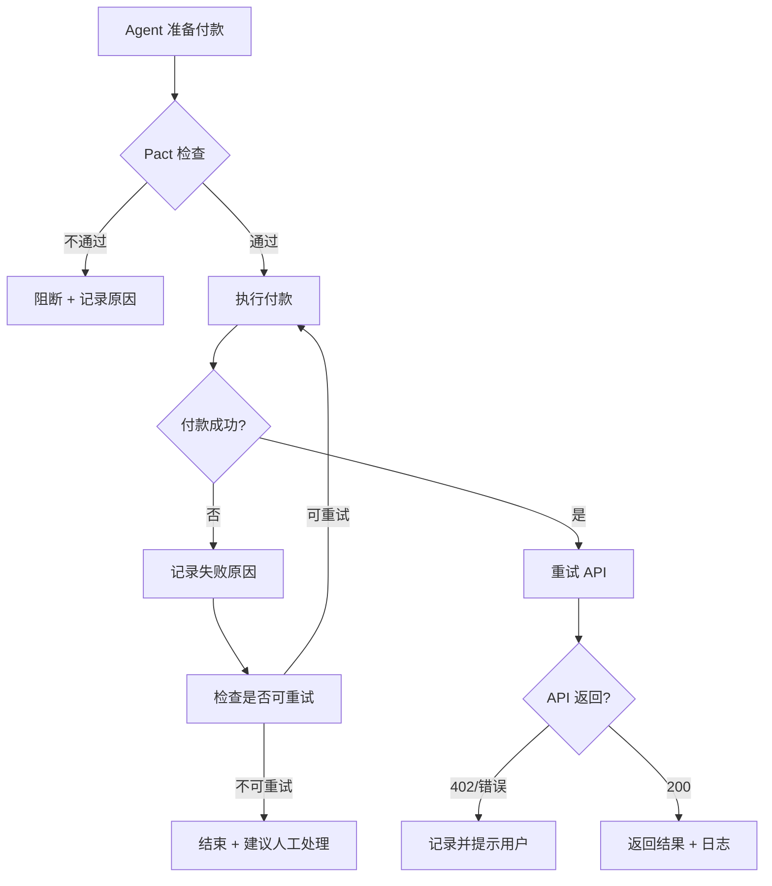

# Week 2｜进阶实践｜x402 Paywall + CAW Agent 自主支付闭环

## 题目

# x402 Paywall + CAW Agent 自主支付闭环设计
## 面向 DAO 治理与 Web3 营销总结 API 的最小模型

---

## 一、任务目标

本次任务根据 Week 2 Module B 的进阶实践，设计一个最小化的 x402 paywall + Cobo CAW agent 自主支付闭环。

本方案选择的场景是：

DAO 社区运营者 / Web3 项目市场人员让 AI agent 生成一份治理提案总结与社区传播文案。Agent 请求一个受 x402 paywall 保护的 DAO Summary API，服务端返回付款要求；agent 根据 CAW / Pact 检查预算、服务商、动作范围和时间窗口，在授权范围内完成付款；付款成功后重新请求 API，并获得总结结果。

本方案的重点不是让 agent "无限制自动付款"，而是展示：

agent 如何在明确授权、预算控制、操作范围限制和可审计记录下完成自动交易。

x402 的核心价值在于通过 HTTP 402 Payment Required 状态码，让 API 或数字内容可以直接通过 HTTP 进行程序化付款；服务端在未付款时返回付款要求，客户端付款后重试请求。Cobo Agentic Wallet 的核心价值在于让 AI agent 可以执行链上操作，但这些操作受到结构化授权模型约束；其中 Pact 定义了 agent 被允许做什么、在什么规则下做、以及授权何时结束。

---

## 二、场景设定

### 2.1 场景名称

**DAO Growth Summary API**

中文名称：

> DAO 治理与社区传播总结 API

### 2.2 一句话介绍

DAO Growth Summary API 是一个受 x402 paywall 保护的付费 API。它可以根据 DAO 提案内容，生成治理摘要、争议点、预算影响、风险提醒和适合社区传播的营销文案。消费方不是人工手动付款，而是由 AI agent 在 CAW / Pact 设定的预算和权限范围内完成付款并获取结果。

### 2.3 为什么这个场景适合我？

我的方向更偏市场营销、社区运营和产品商业化，因此本场景选择的不是高风险 DeFi 自动交易，而是 Web3 社区运营服务。

DAO 和 Web3 项目经常需要把复杂的治理提案、预算计划和会议讨论转化成社区成员看得懂的内容。这个过程与市场营销中的用户教育、内容传播、社区参与和项目增长有关。

本场景中，AI agent 购买的服务不是单纯的数据，而是一个面向运营场景的付费总结服务，适合展示 agent commerce 中的：

- 服务发现；
- 付款要求；
- 预算授权；
- 自动支付；
- 结果获取；
- 审计记录；
- 风险边界。

---

## 三、核心角色

| 角色 | 对应对象 | 职责 |
| ---- | ---- | ---- |
| 服务使用者 | DAO 社区运营者 / Web3 市场人员 | 输入提案内容，要求 agent 生成总结和传播文案 |
| 消费方 Agent | DAO Summary Agent | 请求 API、识别 x402 付款要求、检查 Pact、完成付款、获取结果 |
| 服务提供方 | DAO Growth Summary API | 提供受 x402 paywall 保护的总结服务 |
| 钱包与权限层 | Cobo Agentic Wallet / CAW | 限制 agent 的预算、服务商、动作范围和时间窗口 |
| 授权规则 | Pact | 定义 agent 可以支付多少钱、支付给谁、何时有效、何时必须人工确认 |
| 结算与记录层 | Payment settlement + Audit log | 记录付款、结果、失败原因和审计信息 |

---

## 四、总体架构图



---

## 五、最小闭环流程

### 5.1 流程概览

| 步骤 | 动作 | 说明 |
| ---- | ---- | ---- |
| 1 | 用户提交任务 | DAO 运营者输入提案内容，要求生成总结 |
| 2 | Agent 请求 API | Agent 请求 DAO Growth Summary API |
| 3 | API 返回 402 | 服务端发现未付款，返回 x402 付款要求 |
| 4 | Agent 解析付款要求 | 读取金额、币种、网络、收款方、服务说明 |
| 5 | 检查 CAW Pact | 判断是否在预算、服务商、动作和时间窗口内 |
| 6 | 执行付款 | 如果通过检查，CAW 在授权范围内完成付款 |
| 7 | 生成付款证明 | 保存 mock receipt / payment proof |
| 8 | Agent 重试请求 | 携带付款证明重新请求 API |
| 9 | API 返回结果 | 返回治理摘要和社区传播文案 |
| 10 | 保存审计日志 | 记录请求、付款、结果和风险判断 |

### 5.2 时序图



---

## 六、x402 Paywall 设计

### 6.1 服务端 API

**API 名称：** DAO Growth Summary API

**接口：** `POST /api/dao-summary`

**服务功能：** 输入 DAO 提案内容，返回治理总结、争议点、预算影响、风险提醒和社区传播文案。

### 6.2 用户请求示例

```json
{
  "proposal_title": "Community Growth Campaign",
  "proposal_text": "The DAO proposes to allocate treasury funds for a three-month community growth campaign, including content marketing, community events, and user education.",
  "target_audience": "普通社区成员",
  "output_type": "governance_summary_and_marketing_brief"
}
```

### 6.3 未付款时的 x402 响应

当 Agent 第一次请求 API 时，如果没有携带付款证明，服务端返回：

```
HTTP/1.1 402 Payment Required
Content-Type: application/json
```

```json
{
  "x402Version": 1,
  "service": "DAO Growth Summary API",
  "amount": "0.03",
  "currency": "USDC",
  "network": "Base-Sepolia",
  "recipient": "0xServiceProviderDemo",
  "description": "Generate one DAO governance summary and marketing brief",
  "expires_at": "2026-05-26T23:59:00+09:00"
}
```

说明：amount 为本次 API 调用价格，currency 为支付币种，network 为支付网络，recipient 为服务提供方收款地址，expires_at 为付款要求过期时间。x402 协议让服务可以通过 HTTP 402 要求付款，客户端付款后再重试请求，从而实现 API 和数字内容的程序化支付。

### 6.4 付款成功后的 API 结果

Agent 付款后携带 payment proof 重新请求：

```
POST /api/dao-summary
Content-Type: application/json
X-PAYMENT: mock_pay_001
```

API 返回：

```json
{
  "status": "success",
  "result": {
    "summary": "该提案建议 DAO 使用一部分 treasury 预算进行三个月的社区增长活动，目标是提升成员参与度、内容传播效率和用户教育效果。",
    "key_points": [
      "预算将用于内容传播、社区活动和用户教育",
      "支持者认为该计划有助于提升 DAO 活跃度",
      "反对者可能担心预算使用效率和结果衡量"
    ],
    "marketing_brief": "本提案可以被包装为一次面向长期社区建设的增长实验，重点不是短期拉新，而是帮助更多成员理解 DAO 的价值并参与治理。",
    "risks": [
      "预算使用效果难以量化",
      "活动执行质量依赖运营团队",
      "社区成员可能质疑支出必要性"
    ],
    "next_actions": [
      "明确预算上限和负责人",
      "设置三个月后的复盘节点",
      "在投票前安排一次社区 AMA"
    ]
  }
}
```

---

## 七、CAW / Pact 权限设计

### 7.1 为什么需要 CAW / Pact？

如果 agent 可以直接控制钱包付款，会带来明显风险：

- agent 可能被 prompt injection 诱导访问恶意 API；
- agent 可能支付超出预算的金额；
- agent 可能把钱付给错误地址；
- agent 可能重复付款；
- 用户事后无法追踪 agent 为什么付款；
- 如果没有时间窗口，agent 权限可能长期存在。

Cobo Agentic Wallet 的设计重点是让 agent 能执行链上操作，但必须受到结构化授权模型约束；Pact 定义 agent 被允许做什么、规则是什么、授权何时结束。

因此，本方案中 CAW / Pact 的作用是：不让 agent 拥有无限钱包权限，而是给它一个有限、可撤销、可审计的支付边界。

### 7.2 Pact 权限配置

```json
{
  "pact_name": "DAO Summary API Payment Pact",
  "agent": "DAO Summary Agent",
  "owner": "DAO Community Operator",
  "allowed_service": "DAO Growth Summary API",
  "allowed_recipient": "0xServiceProviderDemo",
  "allowed_action": [
    "read_payment_requirement",
    "pay_x402_invoice",
    "retry_paid_request",
    "save_audit_log"
  ],
  "budget": {
    "currency": "USDC",
    "single_payment_limit": "0.05",
    "total_budget": "1.00",
    "daily_limit": "0.30"
  },
  "time_window": {
    "valid_from": "2026-05-26T00:00:00+09:00",
    "valid_until": "2026-05-27T00:00:00+09:00"
  },
  "allowed_network": ["Base-Sepolia"],
  "requires_human_confirmation_if": [
    "amount > 0.05 USDC",
    "recipient is not allowed_recipient",
    "network is not allowed_network",
    "total_budget exceeded",
    "daily_limit exceeded",
    "payment purpose is not API access",
    "request asks for private key or seed phrase",
    "service description does not match DAO summary task"
  ],
  "logging_required": true,
  "revocation": {
    "can_revoke_anytime": true,
    "revoked_by": "wallet_owner"
  }
}
```

### 7.3 Pact 检查表

| 检查项 | Pact 限制 | 当前请求 | 是否通过 |
| ---- | ---- | ---- | ---- |
| 单次支付上限 | 0.05 USDC | 0.03 USDC | 通过 |
| 总预算 | 1.00 USDC | 当前累计 0.27 USDC | 通过 |
| 每日预算 | 0.30 USDC | 当前今日累计 0.09 USDC | 通过 |
| 服务商 | DAO Growth Summary API | 匹配 | 通过 |
| 收款方 | 0xServiceProviderDemo | 匹配 | 通过 |
| 动作类型 | pay_x402_invoice | 匹配 | 通过 |
| 网络 | Base-Sepolia | 匹配 | 通过 |
| 时间窗口 | 24 小时内 | 未过期 | 通过 |
| 服务目的 | DAO summary API access | 匹配 | 通过 |

---

## 八、Agent 自主支付流程

### 8.1 Agent 决策流程图



### 8.2 可以自动化的步骤

| 步骤 | 是否可自动化 | 原因 |
| ---- | ---- | ---- |
| 请求 API | 可以 | 不涉及资金风险 |
| 识别 HTTP 402 | 可以 | 只是读取付款要求 |
| 解析金额、网络、收款方 | 可以 | 信息处理 |
| 检查 Pact | 可以 | 按预设规则判断 |
| 小额付款 | 可以，但必须在 Pact 内 | 已有预算和服务商限制 |
| 重试请求 | 可以 | 付款后继续流程 |
| 保存日志 | 必须自动化 | 保证可审计 |

### 8.3 必须人工确认的情况

| 情况 | 处理方式 |
| ---- | ---- |
| 单次金额超过 0.05 USDC | 阻断，要求人工确认 |
| 总预算超过 1 USDC | 阻断，要求重新授权 |
| 收款方不是白名单服务商 | 阻断 |
| 网络不是 Base-Sepolia | 阻断 |
| 服务内容不是 DAO 总结 API | 阻断 |
| API 要求私钥、助记词、API Key | 直接拒绝 |
| 请求重复付款 | 阻断并提示用户 |
| 时间窗口过期 | 阻断，要求重新授权 |
| agent 无法判断付款目的 | 降级为人工确认 |

---

## 九、最小 Mock Demo 设计

由于本阶段不一定完成真实链上付款，可以提交一个本地 mock demo，重点展示闭环逻辑。

### 9.1 文件结构

```
x402-caw-agent-demo/
├── README.md
├── server.js
├── agent.js
├── pact.json
├── mock-payment.js
└── audit-log.json
```

### 9.2 文件说明

| 文件 | 作用 |
| ---- | ---- |
| README.md | 项目说明、架构图、流程图、风险边界 |
| server.js | 模拟受 x402 paywall 保护的 DAO Summary API |
| agent.js | 模拟 agent 请求 API、识别 402、检查 Pact、付款、重试 |
| pact.json | 保存 CAW / Pact 权限策略 |
| mock-payment.js | 模拟付款，不接真实钱包和真实资金 |
| audit-log.json | 保存请求、付款、结果和失败记录 |

---

## 十、关键伪代码

### 10.1 server.js

```javascript
// Mock x402 paywall server
// 说明：这是伪代码 / demo 逻辑，不处理真实资金

app.post("/api/dao-summary", (req, res) => {
  const paymentProof = req.headers["x-payment"];

  if (!paymentProof) {
    return res.status(402).json({
      x402Version: 1,
      service: "DAO Growth Summary API",
      amount: "0.03",
      currency: "USDC",
      network: "Base-Sepolia",
      recipient: "0xServiceProviderDemo",
      description: "Generate one DAO governance summary and marketing brief",
      expires_at: "2026-05-26T23:59:00+09:00"
    });
  }

  if (!verifyMockPayment(paymentProof)) {
    return res.status(402).json({
      error: "Invalid payment proof"
    });
  }

  return res.json({
    status: "success",
    result: {
      summary: "该提案建议 DAO 使用 treasury 预算进行社区增长活动。",
      key_points: [
        "预算用于内容传播、社区活动和用户教育",
        "支持者认为该计划有助于提升 DAO 活跃度",
        "反对者可能担心预算使用效率和结果衡量"
      ],
      marketing_brief: "本提案可被包装为一次面向长期社区建设的增长实验。",
      risks: [
        "预算效果需要追踪",
        "活动目标需要量化",
        "社区成员可能质疑支出必要性"
      ],
      next_actions: [
        "明确预算负责人",
        "设定传播 KPI",
        "安排投票前 AMA"
      ]
    }
  });
});
```

### 10.2 agent.js

```javascript
// Mock CAW Agent Consumer
// 说明：这是伪代码 / demo 逻辑，不接真实钱包

async function runAgentTask() {
  const requestBody = {
    proposal_title: "Community Growth Campaign",
    proposal_text: "The DAO proposes to fund community growth...",
    target_audience: "普通社区成员",
    output_type: "governance_summary_and_marketing_brief"
  };

  const firstResponse = await callApiWithoutPayment(requestBody);

  if (firstResponse.status === 402) {
    const paymentRequirement = firstResponse.body;

    saveAuditLog({
      event: "payment_required_received",
      paymentRequirement,
      timestamp: new Date().toISOString()
    });

    const pactCheck = checkPact(paymentRequirement, "./pact.json");

    if (!pactCheck.allowed) {
      saveAuditLog({
        event: "payment_blocked",
        reason: pactCheck.reason,
        paymentRequirement,
        timestamp: new Date().toISOString()
      });

      return {
        status: "blocked",
        reason: pactCheck.reason
      };
    }

    const paymentProof = createMockPayment(paymentRequirement);

    saveAuditLog({
      event: "payment_completed",
      paymentProof,
      timestamp: new Date().toISOString()
    });

    const paidResponse = await callApiWithPayment(requestBody, paymentProof.payment_id);

    saveAuditLog({
      event: "result_received",
      result: paidResponse.body,
      timestamp: new Date().toISOString()
    });

    return paidResponse.body;
  }

  return firstResponse.body;
}
```

### 10.3 checkPact 逻辑

```javascript
function checkPact(paymentRequirement, pact) {
  if (paymentRequirement.amount > pact.budget.single_payment_limit) {
    return { allowed: false, reason: "Single payment limit exceeded" };
  }

  if (paymentRequirement.recipient !== pact.allowed_recipient) {
    return { allowed: false, reason: "Recipient is not allowed" };
  }

  if (!pact.allowed_network.includes(paymentRequirement.network)) {
    return { allowed: false, reason: "Network is not allowed" };
  }

  if (paymentRequirement.service !== pact.allowed_service) {
    return { allowed: false, reason: "Service is not allowed" };
  }

  if (new Date(paymentRequirement.expires_at) < new Date()) {
    return { allowed: false, reason: "Payment requirement expired" };
  }

  return { allowed: true, reason: "Payment is within Pact policy" };
}
```

### 10.4 mock-payment.js

```javascript
function createMockPayment(paymentRequirement) {
  return {
    payment_status: "paid",
    payment_id: "mock_pay_001",
    amount: paymentRequirement.amount,
    currency: paymentRequirement.currency,
    recipient: paymentRequirement.recipient,
    network: paymentRequirement.network,
    tx_hash: "0xMockTransactionHash",
    timestamp: new Date().toISOString()
  };
}

function verifyMockPayment(paymentProof) {
  return paymentProof === "mock_pay_001";
}
```

---

## 十一、审计日志设计

### 11.1 为什么需要审计日志？

Agent commerce 的重点不是"自动付款成功"就结束，而是要能回答：

- agent 为什么付款？
- 付款要求来自哪个服务？
- 金额是否在预算内？
- 是否符合 Pact？
- 是否重复付款？
- 付款后拿到了什么结果？
- 如果失败，失败原因是什么？

因此，所有关键步骤都必须记录。

### 11.2 审计日志字段

| 字段 | 说明 |
| ---- | ---- |
| task_id | 本次任务编号 |
| user_intent | 用户原始目标 |
| api_endpoint | 请求的 API |
| payment_requirement | x402 返回的付款要求 |
| pact_check_result | Pact 检查结果 |
| payment_status | paid / blocked / failed |
| payment_id | 付款证明编号 |
| amount | 支付金额 |
| currency | 支付币种 |
| recipient | 收款方 |
| network | 支付网络 |
| result_received | 是否获得 API 结果 |
| failure_reason | 失败原因 |
| timestamp | 时间戳 |

### 11.3 审计日志样例

```json
[
  {
    "event": "payment_required_received",
    "task_id": "task_001",
    "service": "DAO Growth Summary API",
    "amount": "0.03",
    "currency": "USDC",
    "recipient": "0xServiceProviderDemo",
    "network": "Base-Sepolia",
    "timestamp": "2026-05-26T15:30:00+09:00"
  },
  {
    "event": "pact_check_passed",
    "task_id": "task_001",
    "reason": "Payment is within Pact policy",
    "timestamp": "2026-05-26T15:30:03+09:00"
  },
  {
    "event": "payment_completed",
    "task_id": "task_001",
    "payment_id": "mock_pay_001",
    "amount": "0.03",
    "currency": "USDC",
    "timestamp": "2026-05-26T15:30:05+09:00"
  },
  {
    "event": "result_received",
    "task_id": "task_001",
    "result_type": "governance_summary_and_marketing_brief",
    "timestamp": "2026-05-26T15:30:08+09:00"
  }
]
```

---

## 十二、失败处理设计

### 12.1 失败情况表

| 失败情况 | 处理方式 | 是否继续付款 |
| ---- | ---- | ---- |
| 金额超过 0.05 USDC | 阻断，要求人工确认 | 否 |
| 总预算超过 1 USDC | 阻断，要求重新授权 | 否 |
| 收款方不匹配 | 阻断并记录风险 | 否 |
| 网络不匹配 | 阻断 | 否 |
| 服务内容不匹配 | 阻断 | 否 |
| 付款要求过期 | 重新请求 API 获取新报价 | 否 |
| payment proof 无效 | 不返回结果，记录失败 | 否 |
| API 返回错误结果 | 记录错误，提示用户重试 | 否 |
| 请求私钥 / 助记词 | 直接拒绝 | 否 |
| 重复付款请求 | 检查 payment_id，避免重复支付 | 否 |

### 12.2 失败处理流程图



---

## 十三、风险边界

本 demo 明确不做以下事情：

1. 不接入真实私钥；
2. 不要求用户输入助记词；
3. 不保存 API Key、token、.env 文件；
4. 不处理真实资金；
5. 不连接真实主网钱包；
6. 不执行真实链上付款；
7. 不允许 agent 向非白名单地址付款；
8. 不允许 agent 超出预算付款；
9. 不允许 agent 在时间窗口外付款；
10. 不允许 agent 访问与任务无关的付费服务；
11. 不对 API 返回结果的事实正确性做绝对保证；
12. 所有 mock payment 都只用于演示流程，不代表真实结算。

---

## 十四、真实 Demo 与 Mock Demo 的区别

| 模块 | Mock Demo | 真实 Demo |
| ---- | ---- | ---- |
| x402 paywall | 用本地 server 返回 402 | 使用真实 x402 middleware |
| 付款 | mock-payment.js 生成假 receipt | CAW 发起真实链上付款 |
| 钱包 | 不接钱包 | 使用 Cobo CAW 钱包 |
| Pact | 用 pact.json 模拟 | 使用 CAW Pact 真实配置 |
| 结算 | 无真实结算 | 链上 settlement |
| 审计 | audit-log.json | CAW 记录 + 链上交易记录 |
| 风险 | 低 | 需要严格测试网和资金隔离 |

本阶段提交采用 Mock Demo + 架构设计。这样既能展示完整逻辑，又避免真实资金和私钥风险。

---

## 十五、最小模型运行预期

如果做成简单本地模型，运行结果可以是：

```
User task received:
Generate DAO governance summary and marketing brief.

Calling DAO Growth Summary API...

API response:
402 Payment Required

Payment requirement:
Service: DAO Growth Summary API
Amount: 0.03 USDC
Network: Base-Sepolia
Recipient: 0xServiceProviderDemo

Checking CAW Pact...
Pact check passed.

Creating mock payment...
Payment completed: mock_pay_001

Retrying API with payment proof...

API result received:
- Governance summary generated
- Marketing brief generated
- Risks generated
- Next actions generated

Audit log saved.
```

---

## 十六、最终总结

本方案设计了一个 x402 Paywall + CAW Agent 自主支付闭环的最小模型，场景是面向 DAO 社区运营和 Web3 市场人员的治理与营销总结 API。

在这个流程中，服务提供方通过 x402 paywall 保护 API；当 agent 第一次请求服务时，API 返回 HTTP 402 Payment Required。Agent 解析付款要求后，不会直接付款，而是先检查 CAW / Pact 中的预算、服务商、动作范围、网络和时间窗口。只有当所有条件都符合授权范围时，agent 才会执行付款，并在付款成功后重新请求 API 获取结果。

这个设计体现了 agent commerce 的核心：agent 自主支付并不是给 AI 无限钱包权限，而是在明确授权、预算控制、服务范围限制、时间窗口和审计记录下完成自动交易。

x402 解决的是 API 或数字资源访问中的机器支付问题；CAW / Pact 解决的是 agent 付款时的权限边界、预算控制和可审计执行问题。两者结合后，可以形成一个最小但完整的 agent payment / commerce flow。

本阶段采用 mock demo 的方式，不接触真实私钥、真实资金或真实主网交易，重点展示架构、流程、权限策略、伪代码和风险边界。
